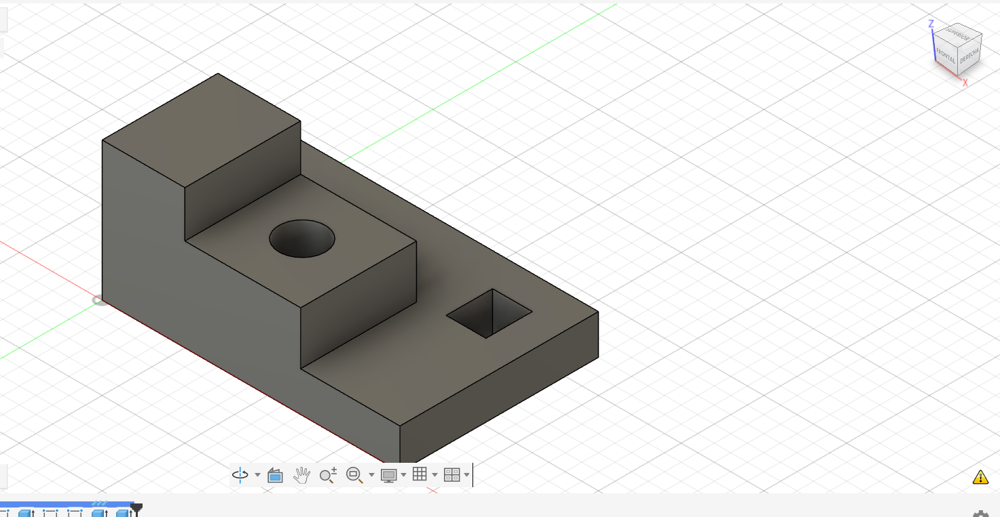
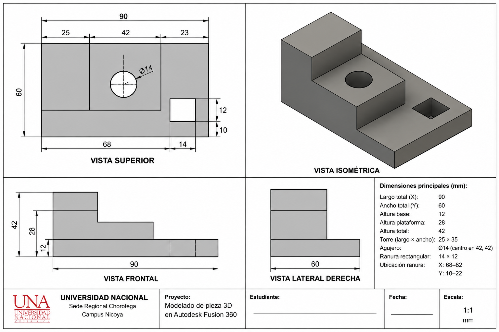
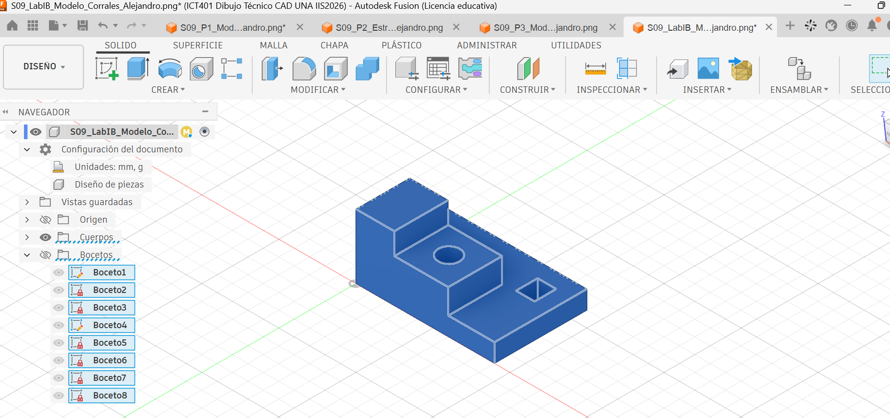
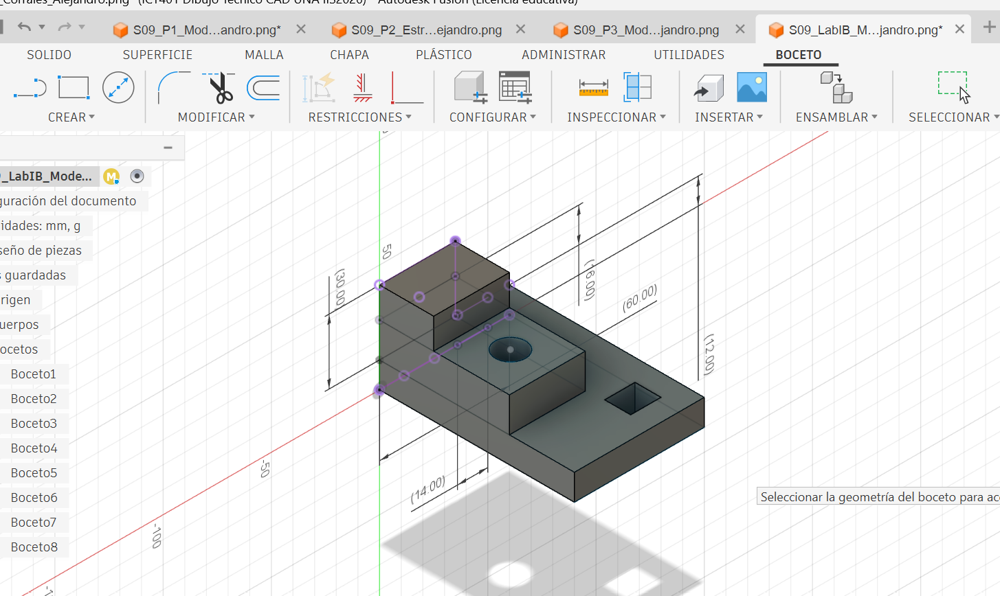

# ICT401 · Semana 9 — Laboratorio integrador I-B

**Reconstrucción 3D a partir de un plano o conjunto de vistas — 10 %**

- Estudiante: [Alejandro Corrales]
- Grupo: [60]
- Fecha: [17/09/2026]
- Nombre del archivo de Fusion: `ICT401_S09_LabIB_Corrales_Alejandro`
- Carpeta/proyecto de Fusion Cloud con acceso docente: []
- Commit de entrega: [S09_Lab_IB_Evidencias_Corrales_Alejandro]

## Instrucciones de uso de esta ficha

Complete esta ficha durante el laboratorio. No borre respuestas iniciales aunque luego las corrija. Cuando cambie una decisión, explique qué evidencia del plano o del modelo motivó la modificación.

La ficha debe quedar en `Portafolio/semana09/` con el nombre `S09_Lab_IB_Evidencias_Apellido_Nombre.md`. Las imágenes enlazadas deben estar en la misma carpeta. El archivo nativo permanece en Fusion Cloud con acceso docente.

Esta ficha forma parte de la evidencia evaluable del Laboratorio integrador I-B y está estructurada para facilitar una revisión posterior por la persona docente o mediante ChatGPT. La calificación final corresponde siempre al instrumento oficial del curso.

---

## A. Interpretación inicial del plano

### A1 · Dimensiones generales

- X total: [90mm]
- Y total: [60mm]
- Z total: [42mm]

### A2 · Características geométricas identificadas

| Nº | Característica | Descripción | Vista(s) que la definen | Dimensiones asociadas |
|---|---|---|---|---|
| 1 | Base | Parte principal de la pieza | Front, Top y Right | 90 × 60 mm |
| 2 | Plataforma | Parte elevada ubicada atrás | Front, Top y Right | X = 0–60, Y = 25–60 |
| 3 | Torre | Parte más alta de la pieza | Front, Top y Right | X = 0–25, Y = 25–60 |
| 4 | Agujero | Agujero circular que atraviesa la pieza | Top | Ø14 mm, centro (42,42) |
| 5 | Ranura | Corte rectangular que atraviesa la pieza | Top | 14 × 12 mm, X = 68–82, Y = 10–22 |

### A3 · Describa la pieza en una frase técnica antes de abrir Fusion

[Es una pieza rectangular que tiene diferentes niveles de altura, con una parte elevada, una torre, un agujero circular y una ranura rectangular.]

### A4 · ¿Qué plano de boceto utilizará primero y por qué?

[Empezaría usando el plano XY (Top), porque desde ahí puedo hacer la forma de la base con sus medidas de ancho y profundidad, y después darle la altura necesaria.]

### A5 · Estrategia inicial de modelado

1. Comenzaría haciendo la parte de abajo de la pieza.
2. Luego le daría la altura que muestra el plano.
3. Después haría la plataforma en la posición indicada.
4. Agregaría la torre para formar la parte más alta.
5. Haría el agujero circular con su medida y ubicación.
6. Al final haría la ranura rectangular y el corte correspondiente.

---

## B. Desarrollo del modelo

### B1 · Boceto base

- Plano seleccionado: Plano XY (Top).
- Geometría principal: Hice un rectángulo para comenzar la pieza.
- Restricciones aplicadas: Usé restricciones horizontales y verticales para mantener la forma.
- Dimensiones aplicadas: Coloqué 90 mm de ancho y 60 mm de profundidad.
- Estado del boceto: El boceto quedó completamente definido.
  
### B2 · Operaciones realizadas

| Nº | Operación | Qué hice |
|---|---|---|
| 1 | Extrude | Le di altura a la base de la pieza. |
| 2 | Sketch + Extrude | Dibujé la plataforma y después la levanté. |
| 3 | Sketch + Extrude | Hice la torre para completar la parte más alta. |
| 4 | Sketch + Cut | Dibujé el círculo de Ø14 mm y realicé el agujero. |
| 5 | Sketch + Cut | Hice la forma de la ranura y luego realicé el corte. |
| 6 | Verificación | Comparé la pieza con el plano para revisar que estuviera correcta. |

### B3 · Cambios realizados durante el modelado

| Nº | Cambio realizado | Razón |
|---|---|---|
| 1 | Cambié un poco la posición de la plataforma. | Para acomodarla mejor según el plano. |
| 2 | Moví el agujero a la ubicación correcta. | Para que quedara donde indican las medidas. |
| 3 | Ajusté la ranura rectangular. | Para que su posición coincidiera con el plano. |
---

## C · Verificación del modelo

### C1 · Comparación de vistas

| Vista | ¿Coincide con el plano? | Qué revisé |
|---|---|---|
| Front | Sí | Comparé el ancho y las alturas de la pieza con el plano. |
| Top | Sí | Revisé que cada parte estuviera ubicada en el lugar correcto. |
| Right | Sí | Comparé la profundidad y la forma de los diferentes niveles. |

### C2 · Verificación de dimensiones

| Medida revisada | Medida del plano | Medida del modelo | ¿Está correcta? |
|---|---:|---:|---|
| Ancho de la pieza | 90 mm | 90 mm | Sí |
| Profundidad de la pieza | 60 mm | 60 mm | Sí |
| Altura de la pieza | 42 mm | 42 mm | Sí |
| Agujero circular | Ø14 mm | Ø14 mm | Sí |
| Ranura rectangular | 14 × 12 mm | 14 × 12 mm | Sí |

### C3 · Editabilidad paramétrica

La pieza quedó hecha por partes y con sus medidas definidas. Si después necesito cambiar alguna medida, puedo entrar al Sketch de esa parte, modificarla y actualizar el modelo sin tener que comenzar desde cero.
## D. Evidencias

### D1 · Modelo final

Modelo completo en orientación pictórica, con nombre del diseño y ViewCube visibles.

### D2 · Vistas de verificación

Montaje de Front, Top y Right del modelo, presentado de manera clara para comparar con el plano base.

### D3 · Boceto y restricciones

Captura del boceto más representativo con restricciones y dimensiones visibles.

### D4 · Timeline / historial paramétrico

Captura donde se observen las operaciones principales del historial del modelo.

### D5 · Verificación dimensional

Captura de `Inspect > Measure` con una dimensión crítica y el elemento seleccionado visibles.

---

## E. Checklist de entrega

- [xxx ] Analicé el plano antes de comenzar el modelado.
- [x ] Registré X, Y y Z totales.
- [x ] Identifiqué las características principales y las vistas que las definen.
- [x ] Registré una estrategia inicial antes de modelar.
- [ xx] El modelo final corresponde a Front, Top y Right.
- [ x] Verifiqué al menos cinco dimensiones críticas.
- [ x] Los bocetos principales tienen restricciones y dimensiones coherentes.
- [x ] El historial de operaciones es legible y editable.
- [ x] El nombre del archivo cumple la nomenclatura solicitada.
- [xx ] El archivo editable está disponible en Fusion Cloud con acceso docente.
- [x ] Las cinco evidencias se visualizan correctamente en GitHub.
- [x ] Esta ficha está completa.

---

# F. Rubrica oficial del Laboratorio integrador I-B

La tabla siguiente registra la evaluacion aplicada exclusivamente a esta ficha y sus evidencias enlazadas o insertadas. Los valores coinciden con el Excel y el PDF individual.

| Criterio oficial | Valor maximo | Puntaje obtenido | Observaciones de evaluacion |
|---|---:|---:|---|
| Interpretacion correcta del plano o conjunto de vistas | 2.00 | 2.00 | Puntaje completo: no se identificaron faltantes para este criterio. |
| Reconstruccion tridimensional coherente | 2.50 | 2.50 | Puntaje completo: no se identificaron faltantes para este criterio. |
| Aplicacion de restricciones y dimensiones | 1.50 | 1.13 | Puntaje parcial: La imagen enlazada en D3 no existe en el repositorio; por eso no se puede verificar visualmente el boceto y sus restricciones. B1 y C2 si contienen datos. |
| Precision geometrica y correspondencia con el plano | 2.00 | 2.00 | Puntaje completo: no se identificaron faltantes para este criterio. |
| Organizacion, nomenclatura y archivo editable | 1.00 | 0.00 | Puntaje 0,00: No indicaste en que proyecto o carpeta de Fusion Cloud esta el archivo editable ni declaraste que tiene acceso docente; ademas, la ficha esta fuera de las rutas oficiales. |
| Presentacion y cumplimiento del enunciado | 1.00 | 0.50 | Puntaje parcial: D3 no tiene imagen disponible y el checklist usa marcas ambiguas como xxx y xx; por eso la entrega formal queda incompleta. |

**Total obtenido: 8.13 / 10,00 %**

La ruta `Laboratorio_I/I-B/` se acepta como ruta oficial alternativa junto con `Portafolio/semana09/`. No se inspeccionaron archivos de Fusion.

## G. Resumen para evaluación asistida por ChatGPT

Este bloque debe permitir una revisión rápida sin tener que inferir información faltante.

- ¿El estudiante interpretó correctamente X, Y y Z? [Respuesta]
- ¿Las características listadas corresponden con el plano? [Respuesta]
- ¿La estrategia inicial es coherente? [Respuesta]
- ¿El modelo final coincide con las tres vistas? [Respuesta]
- ¿Las dimensiones críticas coinciden? [Respuesta]
- ¿Los bocetos muestran restricciones y dimensiones adecuadas? [Respuesta]
- ¿El timeline muestra una reconstrucción paramétrica razonable? [Respuesta]
- ¿El archivo y las evidencias cumplen nomenclatura y presentación? [Respuesta]
- Incidencias que el evaluador debería revisar directamente en Fusion: [Respuesta]

## H. Retroalimentacion del evaluador

### Fortalezas

A1-A5, B1-B3, C1-C2, D1-D2 y D5 son verificables.

### Aspectos por corregir

D3 no tiene imagen disponible; el checklist usa marcas ambiguas y la ruta/nomenclatura no es oficial.

### Desglose del puntaje

| Criterio | Puntaje obtenido |
|---|---:|
| R1 - Interpretacion correcta del plano o conjunto de vistas | 2.00 |
| R2 - Reconstruccion tridimensional coherente | 2.50 |
| R3 - Aplicacion de restricciones y dimensiones | 1.13 |
| R4 - Precision geometrica y correspondencia con el plano | 2.00 |
| R5 - Organizacion, nomenclatura y archivo editable | 0.00 |
| R6 - Presentacion y cumplimiento del enunciado | 0.50 |

No indicaste en que proyecto o carpeta de Fusion Cloud esta el archivo editable ni declaraste que tiene acceso docente; ademas, la ficha esta fuera de las rutas oficiales.
 No se inspeccionaron archivos de Fusion.

### Calificacion final

**8.13 / 10,0 %**