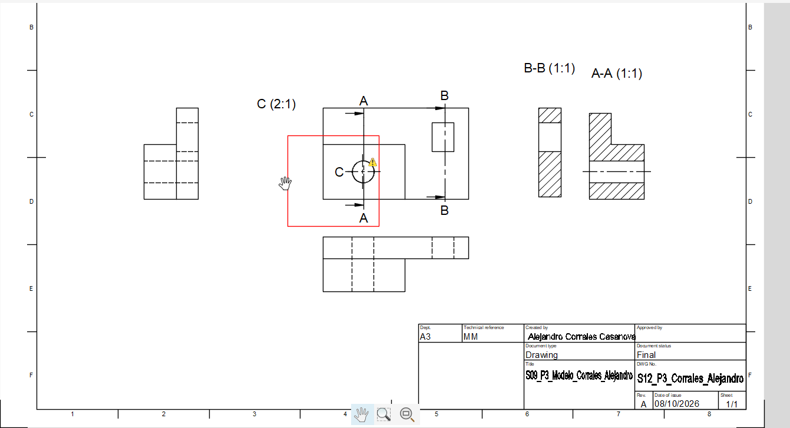

# P5 — Laboratorio integrador II-A, impresión y entrega

**Propósito:** integrar, revisar y entregar el plano técnico completo a partir del Drawing corregido en P1–P4.

**Valor:** Laboratorio integrador II-A, 10 %.

## P5.0 · Pasos en Fusion

1. Se abrió el Drawing trabajado anteriormente.
2. Se confirmó que el modelo y el Drawing correspondieran a la misma pieza.
3. Se revisaron el formato A3, la orientación horizontal, los márgenes y la distribución de las vistas.
4. Se revisó el cajetín y los campos disponibles en Fusion.
5. Se verificaron las vistas principales, las secciones, el detalle C, las cotas y la escala.
6. Se cambió al espacio Design para comparar una característica visible del modelo 3D con el Drawing.
7. No se encontraron diferencias importantes entre el modelo y el Drawing.
8. No fue necesario realizar una corrección adicional al Drawing.
9. Se generó y abrió el PDF para comprobar que las vistas, cotas, secciones, detalle y cajetín se visualizaran correctamente.
10. Se generó y revisó el archivo DXF.
11. Se abrió la previsualización de impresión.
12. Se revisó que el plano se visualizara completo. El equipo utilizado solamente mostraba tamaño A4, por lo que esta condición se registró como una limitación.
13. El Drawing se mantuvo guardado en Fusion.
14. Se organizaron las evidencias, el PDF y el DXF en la carpeta de entrega.
15. Se realizó la revisión final de los archivos.

---

## P5.1 · Checklist

- [x] El modelo y el Drawing corresponden a la misma pieza.
- [x] El formato y la orientación son adecuados.
- [x] El cajetín está legible.
- [x] El formato, marco y zona de identificación fueron revisados con el criterio de ISO 5457.
- [x] Los campos disponibles del cajetín fueron contrastados con INTE/ISO 7200:2008.
- [x] La escala general y la escala del detalle están identificadas.
- [x] Las vistas están relacionadas correctamente.
- [x] El corte, las secciones y el detalle conservan su identificación.
- [x] Las cotas son legibles y no presentan superposición importante.
- [x] Las cotas fueron revisadas con el criterio de ISO 129-1.
- [x] El PDF abre correctamente y coincide con el Drawing.
- [x] El DXF fue generado y revisado.
- [x] La previsualización de impresión fue revisada.
- [x] La ficha y las imágenes tienen la nomenclatura solicitada.
- [ ] El enlace de Fusion Cloud tiene acceso docente.
- [x] El modelo, Drawing y archivos exportados no presentan contradicciones visibles.
- [ ] La Fase 2 del Proyecto fue entregada según su enunciado.

---

## P5.2 · Revisión por pares

| Criterio | Observación recibida | Corrección aplicada |
|---|---|---|
| Formato y orientación | No se realizó revisión por pares. | No aplica. |
| Cajetín | No se realizó revisión por pares. | No aplica. |
| Escala y legibilidad | No se realizó revisión por pares. | No aplica. |
| Distribución de vistas | No se realizó revisión por pares. | No aplica. |
| PDF/DXF e impresión | No se realizó revisión por pares. | No aplica. |

---

## Evidencias P5

