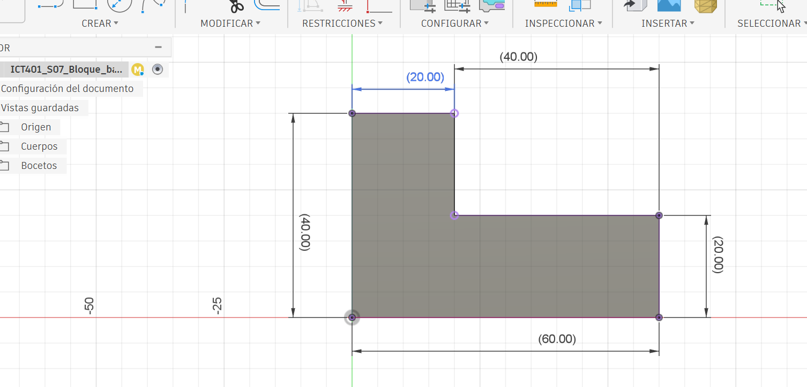
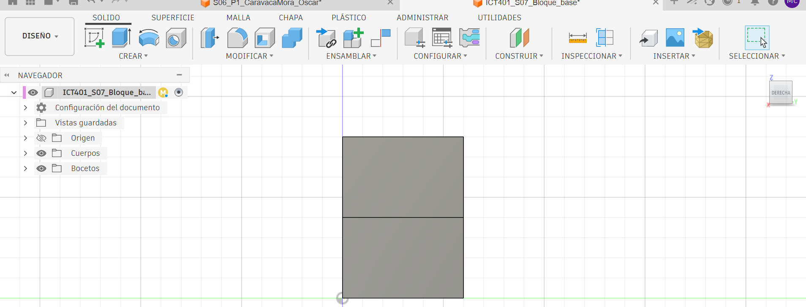
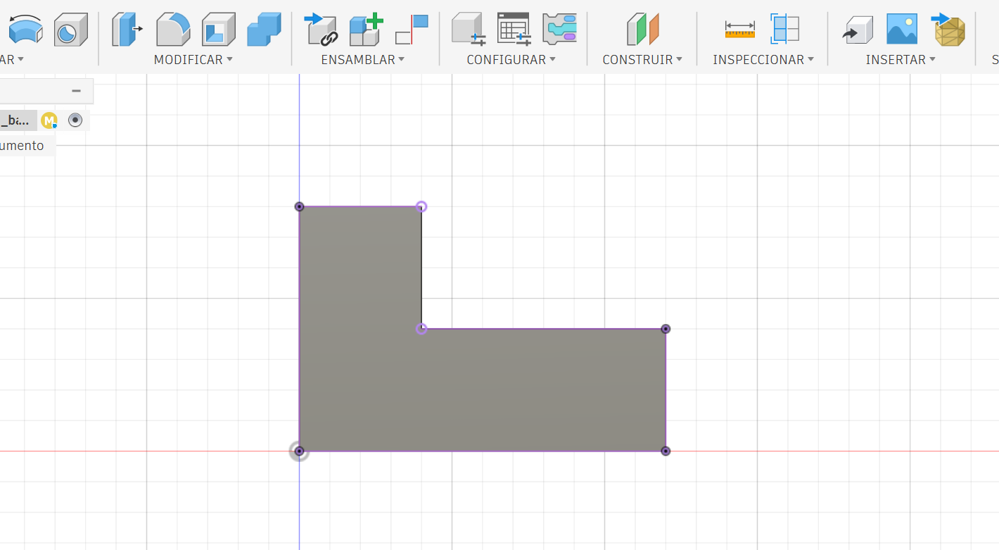
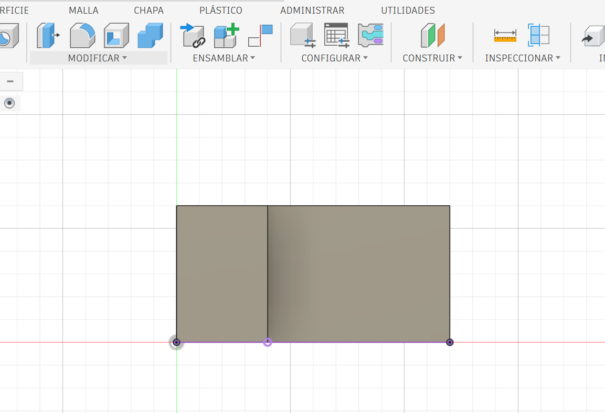

# Semana 7 — Registro de práctica en Fusion

- Estudiante: Manuel Alejandro Corrales Casanova- Grupo:ICT401 - Archivo en Fusion Cloud: `ICT401_S07_Vistas_Alejandro_corrales`
- Carpeta o proyecto con acceso docente: ICT401_S07_ALEJANDRO_CORRALES/Plantilla- Sistema para disponer las vistas: primer diedro.
- Cámara de las capturas principales: ortográfica.

## P1 — Predecir, observar y medir

### Predicción y comprobación

Escriba la predicción antes de seleccionar la vista en Fusion: Predijo que se harà un diseño escalonado con todas las herramientas que nos da Fusion. No borre una predicción incorrecta: explique qué corrigió.

| Vista | Predicción sobre el escalón | ¿Qué observé al seleccionarla? |
|---|---|---|
| Front | [la forma del escalon desde un costado] | [se ve directamente de frente el escalon] |
| Top | [la parte de arriba] | [mi comprobacion  fue cierta se ve desde arroba como 2 cuadritos] |
| Right | [se vera la parte de abjo] | [se ve desde un costado dos cuadros ] |

### Medidas verificadas con Inspect > Measure

Seleccione una arista completa y anote su longitud en milímetros. Identifique físicamente la arista, no solo su número o color.

| Dato | Longitud medida (mm) | ¿Qué arista seleccioné? |
|---|---:|---|
| Ancho total | [60 mml] | [Inferios frontal] |
| Profundidad | [30mm] | [paralela a y] |
| Altura máxima | [40mm | [vertical exterior del lado alto] |
| Altura de la parte baja | [20mm] | [vertical de lado bajo] |
| Ancho de la parte alta | [20mm] | [superior frontal] |

### Evidencia del modelo y de una medición

- Vistas que comparten ancho: [unicamente en la vista XZ].
- Vistas que comparten altura: [Se puede ver en XZ Y YZ].
- Vistas que comparten profundidad: [EN YZ].
- Corrección realizada durante la revisión: [Una frase o “no fue necesaria”, con justificación].

## P2 — Vistas principales obtenidas en Fusion

Las capturas documentan orientación y correspondencia. **Este montaje no es un plano a escala**: el zoom puede variar. Las dimensiones se comprueban con Measure, no midiendo píxeles. No estire las imágenes para forzar proporciones.

| Lateral derecha | Frontal |
|---|---|
|  |  |
| Sin vista en esta posición | **Superior**    |

### Correspondencias comprobadas

| Par de vistas | Dimensión compartida | Valor comprobado en el modelo |
|---|---|---:|
| Frontal y superior | [Ancho] | [60mm] |
| Frontal y lateral derecha | [Altura] | [40mm] |
| Superior y lateral derecha | [Profundidad] | [30mm] |

La línea interior de la vista superior representa: el cambio de nivel entre la parte alta y la parte baja del escalón.
La línea horizontal de la lateral derecha representa: el cambio de altura que forma el escalón del modelo.
Una esquina del ViewCube no produce una vista principal porque: muestra el objeto desde varios ejes al mismo tiempo, por lo que genera una vista isométrica y no una vista principal.
La lateral derecha se sitúa a la izquierda en este registro porque: se está utilizando el sistema de proyección de primer diedro.
Corrección realizada después del punto de control: revisé la orientación de las vistas y comprobé que las dimensiones coincidieran correctamente entre la vista frontal, superior y lateral derecha.
P3 — Auditoría usando el modelo
Caso A
Hipótesis inicial: pensé que el error se encontraba en la forma o altura mostrada en la vista frontal.
Acción realizada en Fusion para comprobarla: seleccioné la vista Front desde el ViewCube y comparé directamente la forma del modelo con la vista del caso A.
Error confirmado y corrección justificada: se confirmó que la representación no coincidía correctamente con la geometría del modelo. La vista correcta debe conservar el escalón y mostrar una altura máxima de 40 mm.
Evidencia: vista frontal de P2.
Caso B
Hipótesis inicial: pensé que las dimensiones compartidas entre la vista frontal y la superior no coincidían.
Acción realizada en Fusion y dimensión comprobada: utilicé Inspect > Measure y comprobé el ancho total del modelo, obteniendo un valor de 60 mm.
Error confirmado y corrección justificada: se confirmó que ambas vistas deben representar el mismo ancho de 60 mm. Por eso, si aparecen con dimensiones diferentes en un dibujo a escala común, existe un error de correspondencia.
¿Por qué este caso a escala común no equivale al zoom distinto de mis capturas?: porque en las capturas el zoom puede hacer que una vista se vea más grande o pequeña en la pantalla, pero las medidas reales del modelo siguen siendo las mismas.
Evidencia: vistas frontal y superior de P2.
Caso C
Hipótesis inicial: pensé que el error estaba relacionado con la línea interior mostrada en la vista superior.
Acción realizada en Fusion para comprobarla: seleccioné la vista Top y observé dónde ocurre el cambio de altura entre las dos partes del modelo.
Error confirmado y corrección justificada: la línea interior debe aparecer porque representa el borde donde cambia la altura del escalón. Si se elimina o se coloca en otra posición, la vista superior no representa correctamente el modelo.
Evidencia: vista superior de P2.
Verificación de entrega

El archivo personal está guardado en Fusion Cloud y accesible para el docente.

Completé P1, P2 y P3 con mi trabajo.

Las cinco imágenes se ven al abrir este archivo en GitHub.

Las vistas principales provienen de cámara ortográfica y caras nombradas.

Mi copia conserva el bloque original; no alteré su forma.

El commit usa el mensaje S07 ejercicios Fusion Apellido Nombre.

Esta práctica no sustituye ni duplica la entrega del Laboratorio I-A.
- La línea interior de la vista superior representa: [Respuesta].
- La línea horizontal de la lateral derecha representa: [Respuesta].
- Una esquina del ViewCube no produce una vista principal porque: [Respuesta].
- La lateral derecha se sitúa a la izquierda en este registro porque: [Respuesta].
- Corrección realizada después del punto de control: [Respuesta].

## P3 — Auditoría usando el modelo

Use los casos A, B y C incluidos en la guía. Reutilice las capturas P2 como evidencia; no se piden otras tres imágenes. No modifique la geometría para reproducir los errores.

### Caso A

- Hipótesis inicial: [Respuesta].
- Acción realizada en Fusion para comprobarla: [Respuesta].
- Error confirmado y corrección justificada: [Una o dos frases].
- Evidencia: vista frontal de P2.

### Caso B

- Hipótesis inicial: [Respuesta].
- Acción realizada en Fusion y dimensión comprobada: [Respuesta].
- Error confirmado y corrección justificada: [Una o dos frases].
- ¿Por qué este caso a escala común no equivale al zoom distinto de mis capturas?: [Respuesta].
- Evidencia: vistas frontal y superior de P2.

### Caso C

- Hipótesis inicial: [Respuesta].
- Acción realizada en Fusion para comprobarla: [Respuesta].
- Error confirmado y corrección justificada: [Una o dos frases].
- Evidencia: vista superior de P2.

## Verificación de entrega

- [ ] El archivo personal está guardado en Fusion Cloud y accesible para el docente.
- [ ] Completé P1, P2 y P3 con mi trabajo.
- [ ] Las cinco imágenes se ven al abrir este archivo en GitHub.
- [ ] Las vistas principales provienen de cámara ortográfica y caras nombradas.
- [ ] Mi copia conserva el bloque original; no alteré su forma.
- [ ] El commit usa el mensaje `S07 ejercicios Fusion Apellido Nombre`.
- [ ] Esta práctica no sustituye ni duplica la entrega del Laboratorio I-A.
