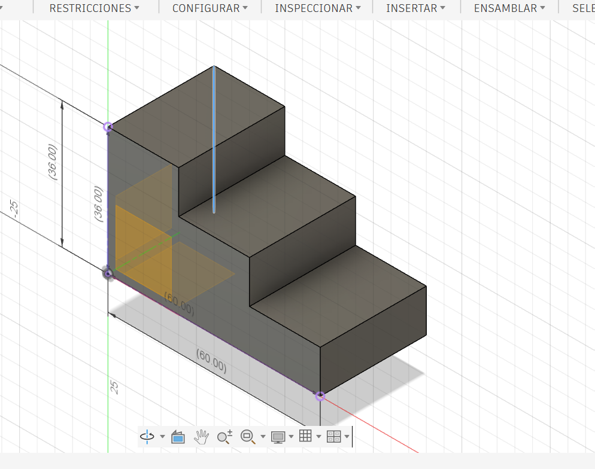
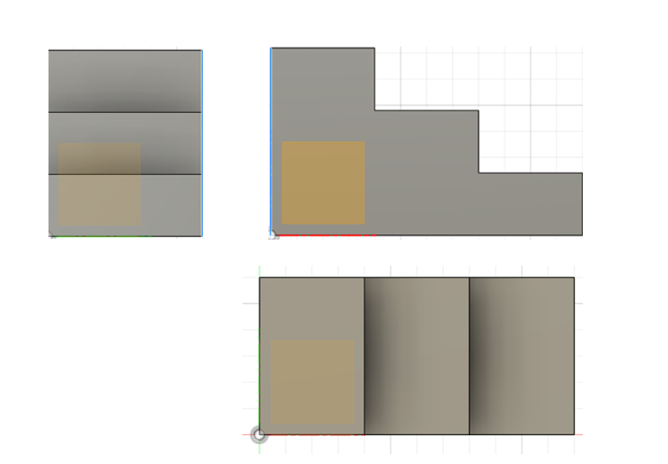
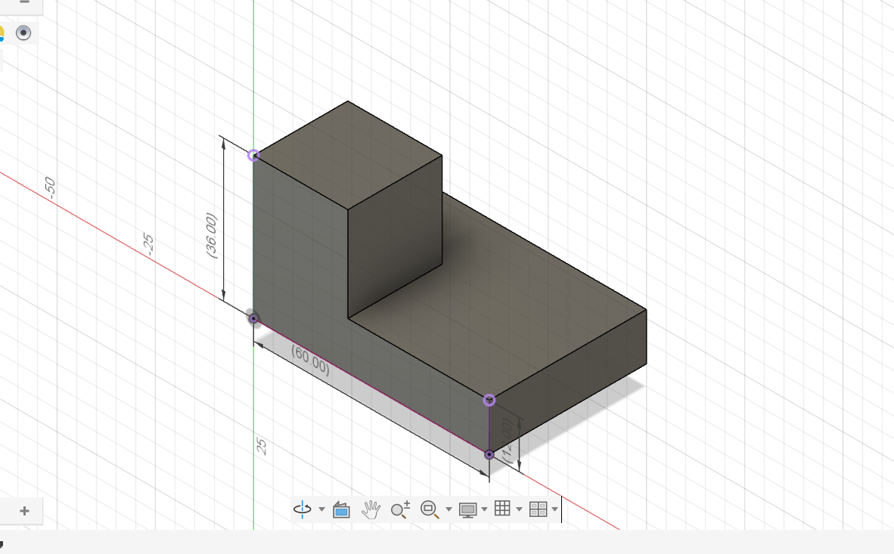
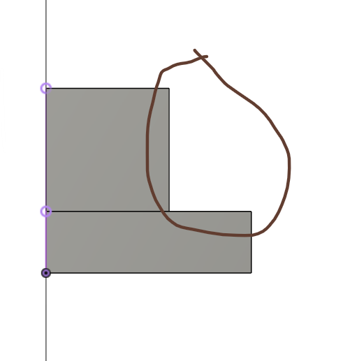
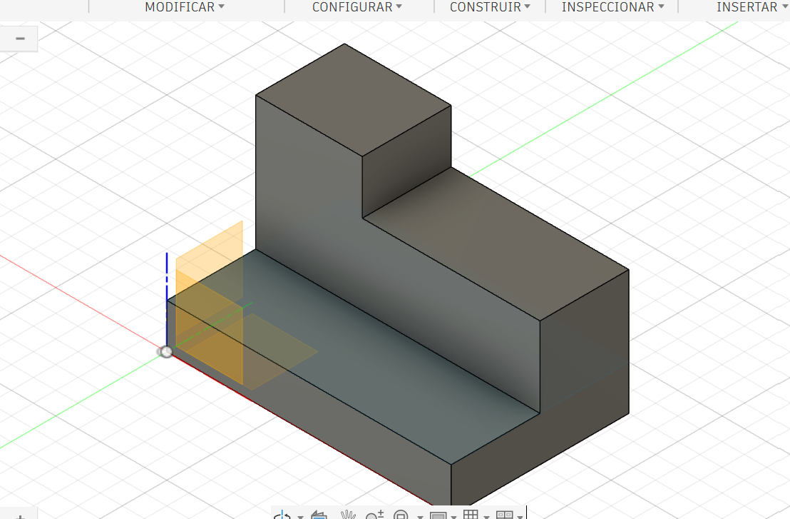
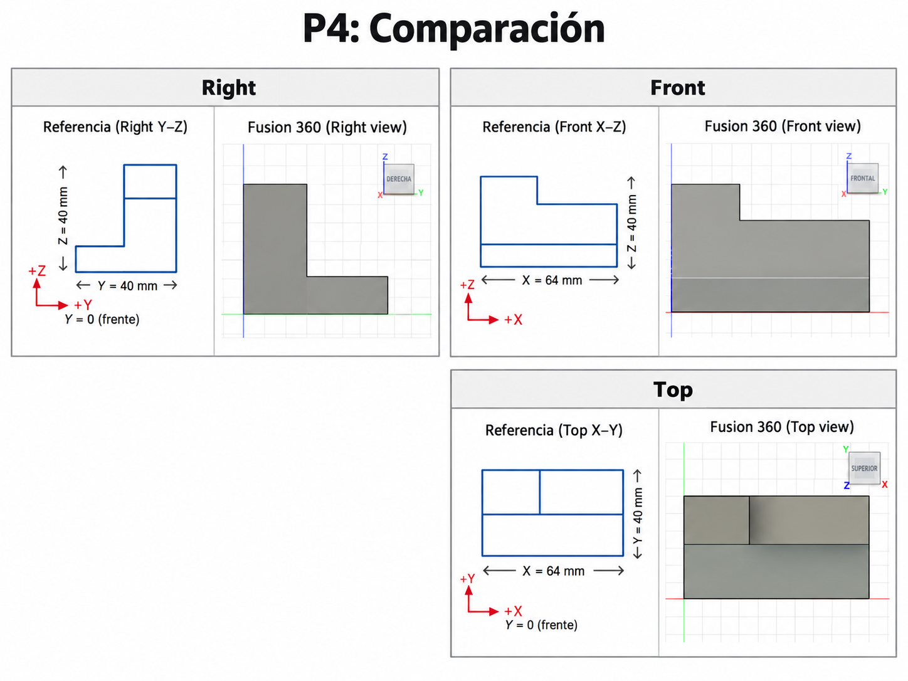
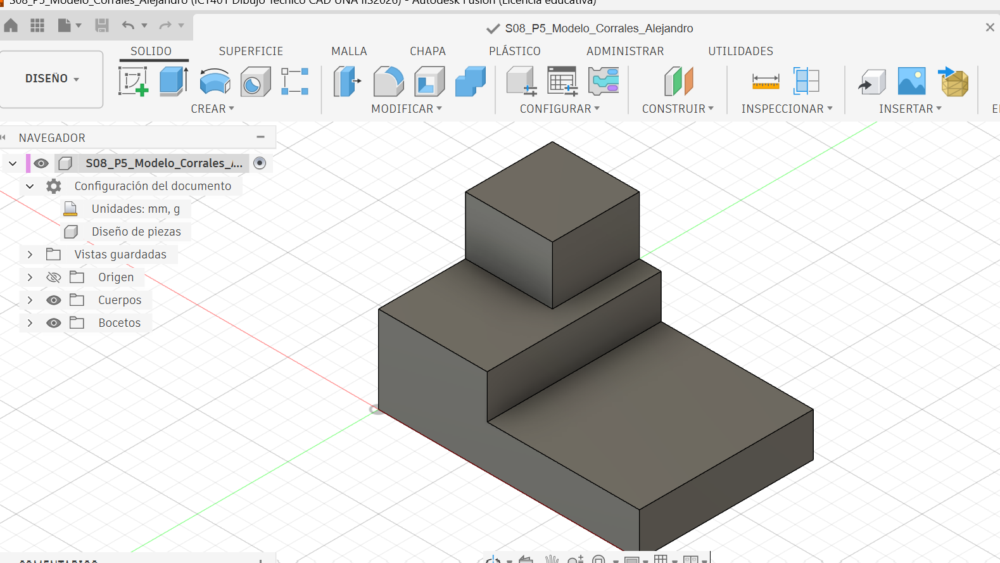
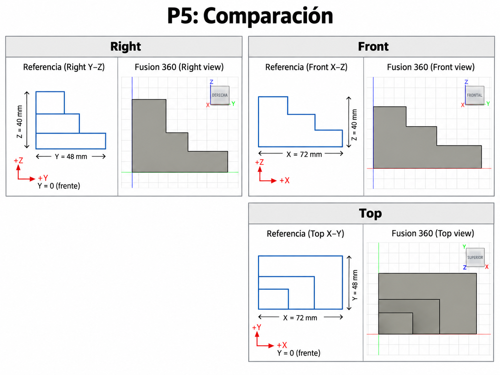

# ICT401 · Semana 8 — Registro formativo de práctica en Fusion

7 al 12 de septiembre de 2026. V Congreso Universitario. Consolidación de contenidos. Sin evaluaciones.

- Estudiante: [Manuel Alejandro Corrales Casanova]
- Grupo: [60]
- Carpeta o proyecto de Fusion Cloud con acceso docente (sin enlaces privados): [Respuesta]
- Modelos proporcionados: `S08_P1_Modelo_Observacion.f3d` y, después de P2, `S08_P2_Modelo_Comprobacion.f3d`.
- Copias personales: `ICT401_S08_P1_Apellido_Nombre` y `ICT401_S08_P2_Apellido_Nombre`.
- Diseños propios: `ICT401_S08_P4_Apellido_Nombre` y `ICT401_S08_P5_Apellido_Nombre`.

## Instrucciones

Copie esta plantilla a `Portafolio/semana08/` y guárdela como `S08_Registro_Apellido_Nombre.md`. Sustituya `Apellido_Nombre` en todos los nombres y enlaces por un apellido y un nombre sin espacios ni tildes. Complete cada [Respuesta], agregue las ocho imágenes en esa misma carpeta y haga commit. No necesita construir otra plantilla.

Escriba las predicciones y decisiones iniciales antes de comprobar. **Nunca borre una respuesta inicial incorrecta:** conserve lo escrito y agregue la corrección y su causa en el apartado posterior. Use la guía para los recursos gráficos y los tiempos de cada P1–P5 (50 minutos cada uno).

X = ancho, Y = profundidad, Z = altura; milímetros. Primer diedro: Right a la izquierda de Front y Top debajo de Front. Cámara ortográfica. Los montajes documentan correspondencia, no son planos a escala: compruebe dimensiones con Measure, no con píxeles. Combine capturas con una herramienta de imágenes o diapositivas y guarde un único PNG por nombre; no deforme imágenes ni oculte el ViewCube. Los recortes temporales no se entregan.

## P1 — Del modelo 3D a las vistas

### P1.1 · Antes de seleccionar Front, Top o Right: ¿qué características, caras y aristas espera ver en cada vista y qué dimensiones aparecerán horizontal y verticalmente?

[Antes de comenzar a seleccionar espero ver una vista en general de las partes esenciales ya sea el ancho y una parte de la altura]

### P1.2 · ¿Cuál vista considera inicialmente más informativa y por qué?

[Inicialmente considero que la vista Front es la más informativa porque permite observar mejor los tres escalones y los cambios de altura de la pieza. ]

### P1.3 · Después de observar Front, Top y Right: ¿qué predicciones confirmó y qué corrigió? Explique por qué sin borrar su respuesta inicial.

[viendo todas las partes bien, me di cuenta que efectivamente front es la parte mas importante ya que es la vista que muestra con mayor claridad los tres niveles de la pieza y sus cambios de altura. También confirmé que Top permite observar el ancho y la profundidad total]

### P1.4 · ¿Qué pares de vistas comparten ancho, altura y profundidad? Anote el valor comprobado en milímetros y la arista seleccionada.

[Ancho:Front y Top. con un valor de 60 mm]
[Altura: la comparten las vistas Front y Right con un valor de 36 mm]
[Profundidad: la comparten las vistas Top y Rightcon un valor de 30 mm.]

### P1.5 · Elija una característica tridimensional: ¿cómo aparece en dos vistas diferentes? Identifique las caras o aristas relacionadas.

[Elegí uno de los cambios de altura de la pieza. En la vista Front se ve como una línea vertical entre un escalón y otro. En la vista Top, ese mismo cambio se ve como una línea que separa una parte de otra. Las dos líneas representan el mismo cambio de nivel, pero visto desde diferentes lados.]

| Vista | Predicción inicial: características y dimensiones | Observación posterior | Corrección y causa |
|---|---|---|---|
| Front | [Esperaba ver la vista completa de los 3 escalones, sin ver la profundidad ] | [Estaba en lo correcto si se ve corretamente los escalones ] | [Estaba en lo correcto no hay corrección] |
| Top | [Esperaba observar un contorno rectangular con líneas donde cambian los niveles, mostrando ancho y profundidad] | [Se observa la superficie desde arriba y las divisiones correspondientes a los cambios de altura.] | [Se confrmo que se ven los cambios de altura] |
| Right | [Esperaba observar principalmente un rectángulo definido por profundidad y altura.] | [Se observa la profundidad y la altura máxima de la pieza.] | [Tuve que considerar mejor las aristas proyectadas] |

| Dimensión compartida | Par de vistas | Valor (mm) y arista seleccionada |
|---|---|---|
| Ancho | [Front y Top] | [60mm] |
| Altura | [Front y Right] | [36] |
| Profundidad | [Top y Right] | [30] |

### Evidencias

Modelo completo en orientación pictórica, ViewCube y nombre de su copia visibles.

Un montaje de tres capturas de Fusion: Right a la izquierda, Front a la derecha y Top debajo de Front; etiquetas y cuerpo completo visibles.

## P2 — De las vistas al modelo mental

### P2.1 · ¿Qué forma general imagina y cuáles son sus cambios de altura?

[me imagino un forma rectangular con un escalon en una esquina, uno bajo que forma la base y otro más alto.]

### P2.2 · ¿La profundidad se mantiene o cambia entre zonas? Relacione las tres vistas.

[En la base se mantiene la misma profundidad en una esquina se observa una parte mas alta que las otras]

### P2.3 · ¿Qué correspondencias encuentra entre vistas?

[En Front y Right se observa una forma parecida a una L, porque ambas muestran el cambio de altura. La vista Top ayuda a ubicar dónde está esa parte alta]

### P2.4 · ¿Qué información aporta Top y qué información aporta Right?

[me da la información que en que parte se presenta el escalon mientras que en right informa que tan alta es esta parte

### P2.5 · Describa verbalmente la pieza imaginada antes de mirar las alternativas.

[Imagino una base rectangular baja con un bloque más alto en una de sus esquinas. La parte alta no ocupa toda la base, por eso se observa un cambio de altura tanto en Front como en Right]

### P2.6 · ¿Selecciona A, B, C o D? Justifique antes de comprobar y descarte cada una de las otras tres mediante una vista.

Selecciono el Modelo B, porque es el que considero que coincide mejor con las tres vistas. En Front se observa la parte alta al lado izquierdo, en Right también aparece un cambio de altura y en Top se nota que la parte elevada ocupa solamente una esquina.
Descarto la A porque tiene una sola linea de escalón 
Descarto la C porque la posicion del escalon estan en otro lado
Descartamos la D porque la altura no coincide con las imágenes 
### P2.7 · Después de comprobar: ¿fue correcta su selección, qué interpretó incorrectamente si falló y qué vista fue decisiva? Conserve la selección inicial y explique la corrección.

[Después de comprobar el modelo, confirmé que mi selección del Modelo B fue correcta. La vista que más me ayudó fue Top, porque permitió ver la ubicación de la parte alta.]

| Alternativa | Justificación inicial: seleccionar o descartar | Vista que apoya mi decisión |
|---|---|---|
| A | [La descarto porque la parte alta no coincide con la profundidad que se muestra.] | [Right] |
| B | [es la correcta porque la parte alta coincide con su posición y con los cambios de altura.] | [Front, Right y Top] |
| C | [La descarto porque la parte alta está en el centro de la pieza.] | [Top] |
| D | [La descarto totalmente porque la ubicación de la parte alta no coincide con la vista desde arriba.] | [Respuesta] |

### Evidencias

Modelo correcto proporcionado por el docente durante la comprobación, en orientación pictórica, con nombre y ViewCube visibles.

## P3 — Detectives de vistas

### P3.1 · Caso A: ¿qué vista parece incorrecta, qué línea produce la inconsistencia, con cuál otra vista entra en contradicción y cómo debería corregirse?

[La vista que parece estar incorrecta es Top. La línea horizontal interna se alarga más de lo que debería y llega hasta el lado derecho. Esa línea debería terminar cuando se encuentra con la línea vertical interna. Al comparar con Front, se nota que la parte alta solo ocupa una zona de la pieza y no continúa por todo el ancho.]

### P3.2 · Caso B: ¿qué dimensión debería conservarse, dónde aparece la contradicción, qué información permite comprobarla y cómo debería corregirse?

[La profundidad debe ser la misma en Top y en Right, porque las dos vistas representan la misma dimensión de la pieza. En el caso aparece una profundidad de 48 mm en Top y de 40 mm en Right, por lo que hay una contradicción.

La medida que debe conservarse es 40 mm y la vista Top debería corregirse de 48 mm a 40 mm. Esto se puede comprobar en Fusion usando la herramienta Measure sobre la profundidad completa del sólido.]

### P3.3 · Caso C: ¿cuál vista no pertenece al conjunto, qué característica lo demuestra, con cuáles vistas entra en contradicción y qué debería mostrar una vista correcta?

[En este caso la vista que no pertenece al conjunto es Front. En esa vista la parte alta aparece del lado derecho, pero al compararla con Top y Right se nota que debería estar del lado izquierdo. La vista Front correcta debería mostrar la parte alta a la izquierda y la parte baja extendiéndose hacia la derecha.]

### P3.4 · Para cada caso: ¿qué acción realizó en Fusion, qué observó y cómo corrigió su hipótesis inicial?

[En el Caso A, puse el modelo en vista Top y revisé las aristas. Observé que la línea interna no debía continuar por todo el ancho, sino terminar donde se encuentra con la otra arista.

En el Caso B, utilicé Measure para revisar la profundidad total del modelo. Así se puede comprobar cuál de las dos medidas es la correcta y corregir la que no coincide.

En el Caso C, puse el modelo en vista Front y observé la posición de la parte alta. Confirmé que se encuentra del lado izquierdo, por lo que la vista Front presentada en el caso estaba invertida y pertenecía a otra pieza.]

### P3.5 · ¿Qué caso documentó en la captura y qué detalle demuestra el error?

[Escogí el Caso B. En la captura se ve Measure, y eso demuestra que la profundidad real del modelo no coincide con una de las medidas dadas en las vistas. Como Top y Right deben tener la misma profundidad, ahí se confirma el error.]

| Caso | Hipótesis inicial | Acción en Fusion y observación | Corrección y causa |
|---|---|---|---|
| A | [Pensé que la línea horizontal de Top estaba incorrecta.] | [Revisé la vista Top y observé dónde terminan las aristas] | [Confirmé que la línea horizontal no debe continuar hasta el lado derecho.] |
| B | [Noté que 48 mm y 40 mm no podían representar la misma profundidad.] | [Revisé la profundidad con Measure.] | [La profundidad debe ser la misma en Top y Right; se corrige Top a 40 mm.] |
| C | [Pensé que Front no pertenecía al conjunto.] | [Revisé la vista Front del modelo y observé la posición de la parte alta.] | [Confirmé que la parte alta debe estar a la izquierda y no a la derecha.] |

### Evidencias

Una vista de Fusion que compruebe uno de los errores; nombre y ViewCube visibles. Para el caso B, incluya Measure con la arista completa y su longitud.

## P4 — Reconstrucción 3D guiada

### P4.1 · Antes de abrir Fusion: indique ancho total, altura máxima, profundidad total y número de niveles o cambios principales.

[La pieza mide 64 mm de ancho, 40 mm de profundidad y su altura máxima es de 40 mm. Tiene tres niveles de altura: 10 mm, 28 mm y 40 mm.]

### P4.2 · ¿Qué vista usará como referencia, qué plano inicial elegirá y cómo será su boceto base? Justifique relacionando las vistas.

[Usé como referencia la vista superio y empecé en el plano XY. Hice un rectángulo de 64 mm por 40 mm, porque esa vista muestra bien el tamaño de la base de la pieza.]

### P4.3 · ¿Cuál será su primera operación 3D y qué características posteriores prevé? Justifique.

[Primero que todo extruí la base 10 mm. Después hice otra extrusión de 18 mm en la parte de atrás para llegar a 28 mm. Por último, extruí 12 mm más en la parte de atrás a la izquierda para llegar a 40 mm. En las extrusiones usé Unir para que todo quedara en una sola pieza.]

### P4.4 · Después de construir: ¿coincide Front, coincide Top y coincide Right? Para cada vista cite un contorno, una arista y una dimensión comprobada.

[Sí, las tres vistas coinciden.

En Front se ve el cambio de altura y se puede comprobar el ancho total de 64 mm y la altura máxima de 40 mm.

En Top se ve el rectángulo de 64 mm por 40 mm y también las líneas que separan las diferentes partes.

En Right se ve la profundidad de 40 mm y la altura máxima de 40 mm.]

### P4.5 · ¿Qué fue necesario corregir y qué Sketch, operación o dimensión controlaba la corrección? Si no hubo cambios, justifique con una comprobación.

[No tuve que hacer muchos cambios. Solo revisé que las medidas estuvieran bien y que las extrusiones quedaran en el lugar correcto. También comprobé que las alturas finales fueran 10 mm, 28 mm y 40 mm.]

| Vista | ¿Coincide? | Contorno y arista | Dimensión comprobada | Corrección |
|---|---|---|---|---|
| Front | Sí | Se ven los cambios de altura | 64 mm de ancho y 40 mm de alto | Revisé que las alturas estuvieran bien |
| Top | Sí | Se ve la forma rectangular y las divisiones | 64 mm × 40 mm | Revisé la posición de las líneas |
| Right | Sí | Se ve el cambio de nivel | 40 mm de profundidad y 40 mm de alto | Revisé las alturas |

### Evidencias

Modelo terminado completo en orientación pictórica, nombre del diseño y ViewCube visibles.

Montaje con tres pares: vista de referencia de esta guía junto a su correspondiente vista de Fusion. Disponga Right a la izquierda, Front a la derecha y Top debajo de Front.

## P5 — Reto de reconstrucción autónoma

### P5.1 · Antes de modelar: indique ancho total, altura máxima y profundidad total.

[La pieza mide 72 mm de ancho, 40 mm de alto y 48 mm de profundidad.]

### P5.2 · ¿Qué vista elegirá para comenzar, qué plano inicial y qué primera operación prevé? Justifique.

[primero comenzaré con la vista Top y usaré el plano XY. Primero haré un rectángulo de 72 mm por 48 mm y después lo extruiré para formar la base. Elegí Top porque ahí se ve mejor la forma general de la pieza y los cambios de profundidad.]

### P5.3 · ¿Qué características posteriores prevé, cuál es la más difícil de interpretar y qué vistas necesita relacionar para comprenderla?

[Después de hacer la base, voy a agregar las partes más altas según las medidas. En Front los cambios están en X = 24 mm y X = 48 mm, y las alturas son 12 mm, 24 mm y 40 mm.

Lo que me parece más difícil es entender cómo cambian esas alturas con la profundidad. Para eso necesito comparar Top con Right, porque ahí aparecen los cambios en Y = 18 mm y Y = 30 mm.]

### P5.4 · Después de construir: ¿coinciden Front, Top y Right? Para cada vista cite un contorno, una arista y una dimensión comprobada.

[Sí, las tres vistas coinciden.

En Front se ven los tres niveles de altura y los cambios en X = 24 mm y X = 48 mm. El ancho total es de 72 mm y la altura máxima es de 40 mm.

En Top se observa el ancho de 72 mm y la profundidad de 48 mm. También aparecen los cambios en X = 24 mm, X = 48 mm, Y = 18 mm y Y = 30 mm.

En Right se ve la profundidad total de 48 mm y los cambios de altura conforme aumenta la profundidad. Los cambios están en Y = 18 mm y Y = 30 mm, con alturas de 40 mm, 24 mm y 12 mm.]

### P5.5 · ¿Funcionó la estrategia inicial, qué tuvo que modificar, qué vista permitió detectarlo y qué haría diferente si reconstruyera nuevamente la pieza?

[Sí, la estrategia inicial funcionó. Lo más importante fue revisar bien las medidas de Top y Right, porque ahí se entiende cómo cambia la profundidad de la pieza. Si la hiciera otra vez, primero marcaría todas las divisiones de X y Y en el boceto para no confundirme con las alturas.]

| Vista | ¿Coincide? | Contorno y arista | Dimensión comprobada (mm) | Corrección y causa |
|---|---|---|---|---|
| Front | Sí | Se ven los tres cambios de altura | 72 mm de ancho y 40 mm de alto | Revisé los cambios en X = 24 mm y X = 48 mm |
| Top | Sí | Se ve la forma general y las divisiones | 72 mm × 48 mm | Revisé los cambios en X y Y |
| Right | Sí | Se ven los cambios de altura con la profundidad | 48 mm de profundidad y 40 mm de alto | Revisé los cambios en Y = 18 mm y Y = 30 mm |

### Evidencias

Modelo terminado completo en orientación pictórica, nombre del diseño y ViewCube visibles.

Montaje con tres pares: vista de referencia de esta guía junto a su correspondiente vista de Fusion. Disponga Right a la izquierda, Front a la derecha y Top debajo de Front.

## Reflexión final

### Una vista por sí sola puede ser insuficiente porque:

Con una sola vista no siempre se entiende bien cómo es la pieza completa, porque puede faltar información sobre la altura, el ancho o la profundidad. Por eso es mejor comparar Front, Top y Right.

### Para relacionar correctamente varias vistas debo comprobar:

Debo fijarme en que las medidas coincidan entre las vistas y ver dónde están los cambios de altura, ancho y profundidad. También hay que revisar bien la posición de las líneas y aristas.

### Antes de comenzar una reconstrucción 3D conviene:

Conviene revisar primero todas las vistas y anotar las medidas principales. También ayuda pensar cuál vista es más fácil para empezar el boceto y así evitar tener que corregir tanto después.

### La diferencia principal entre lo que hice en Semana 7 y Semana 8 es:

En la Semana 8 tuve que comparar más las vistas y entender mejor cómo se relacionan entre sí para poder construir la pieza en Fusion. No fue solo copiar una forma, sino tratar de imaginar primero cómo era en 3D.

### Lo que todavía necesito practicar antes de reconstruir una pieza a partir de un plano es:

Todavía necesito practicar un poco más cómo interpretar las vistas, sobre todo cuando cambian varias alturas y profundidades al mismo tiempo. También quiero mejorar usando las medidas para no confundirme tanto al hacer los bocetos.

## Checklist

- [x ] Completé P1 antes y después de observar las vistas.
- [x ] Justifiqué mi selección en P2.
- [ x] Identifiqué y comprobé inconsistencias en P3.
- [ x] Planifiqué P4 antes de comenzar a modelar.
- [ x] Comprobé P4 contra las tres vistas originales.
- [ x] Realicé P5 con mayor autonomía.
- [ x] Comprobé P5 contra las vistas originales.
- [ x] Respondí las preguntas de reflexión.
- [ x] Las ocho imágenes se visualizan correctamente en GitHub.
- [ x] Mis modelos P4 y P5 están disponibles para revisión docente en Fusion Cloud.
- [ x] Conservé mis predicciones iniciales aunque fueran incorrectas.
- [ x] Expliqué las correcciones realizadas.
- [ x] El commit utiliza el mensaje solicitado.

Commit: `S08 ejercicios Fusion Apellido Nombre`.

Corrección posterior: `S08 correccion Fusion Apellido Nombre`.

Abra el registro en GitHub y compruebe los ocho enlaces. Los archivos nativos permanecen en Fusion Cloud con acceso docente. Este registro conserva práctica formativa y no constituye una entrega evaluada de portafolio.
