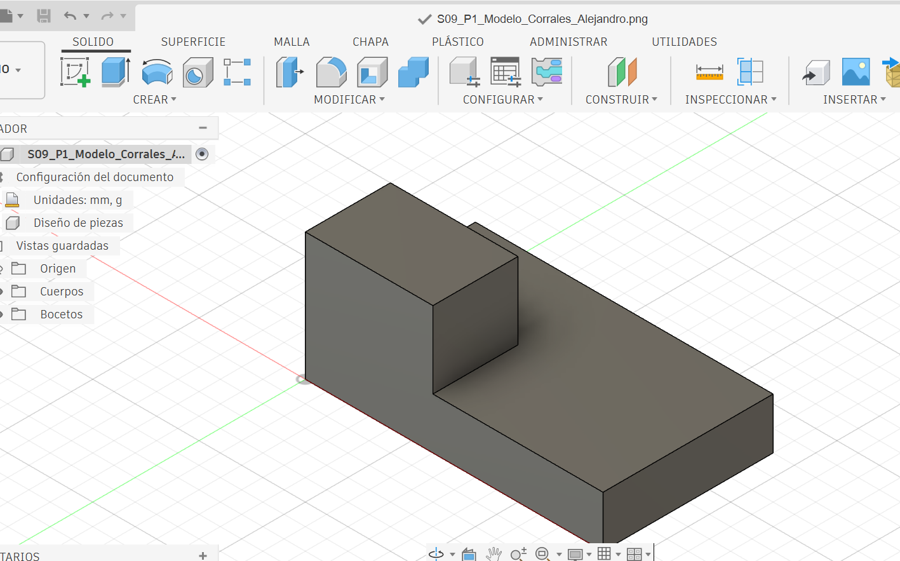
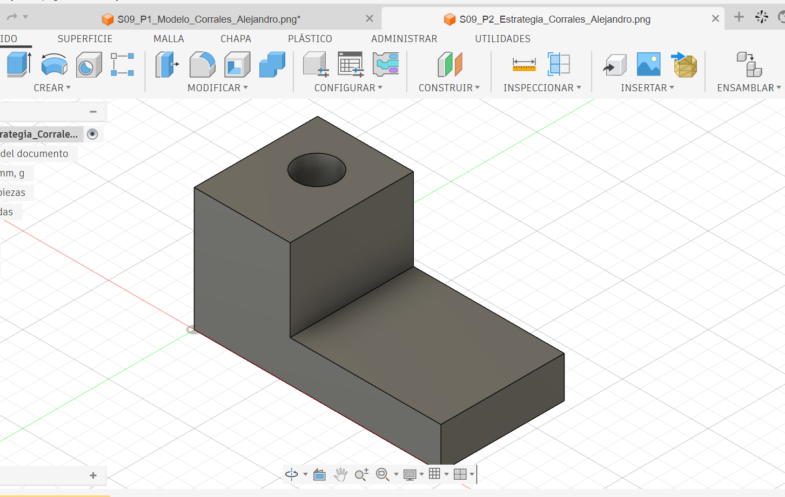

# ICT401 · Semana 9 — Registro de interpretación y reconstrucción 3D

14 al 19 de septiembre de 2026.

- Estudiante: [Respuesta]
- Grupo: [Respuesta]
- Carpeta o proyecto de Fusion Cloud con acceso docente: [Respuesta]
- Copias personales: `ICT401_S09_P1_Apellido_Nombre`, `ICT401_S09_P2_Apellido_Nombre`, `ICT401_S09_P3_Apellido_Nombre`.

## Instrucciones

Copie esta plantilla a `Portafolio/semana09/` y guárdela como `S09_Registro_Apellido_Nombre.md`. Sustituya `Apellido_Nombre` por un apellido y un nombre sin espacios ni tildes. Complete cada `[Respuesta]`, agregue las imágenes solicitadas en la misma carpeta y haga commit.

Conserve siempre la estrategia inicial. Si modifica una decisión durante el modelado, no borre lo anterior: describa qué cambió, qué evidencia del plano o del modelo motivó la corrección y qué elemento paramétrico modificó.

X = ancho, Y = profundidad, Z = altura. Trabaje en milímetros. Cuando compare vistas, mantenga Front, Top y Right con orientación coherente y cámara ortográfica.

---

## P1 — Del plano a la estrategia de modelado

### P1.1 · Dimensiones generales identificadas antes de abrir Fusion

- X total: 70 mm
- Y total: 40 mm
- Z total: 30 mm

### P1.2 · Características geométricas identificadas

| Característica | Descripción | Vista(s) que la definen | Dimensiones asociadas |
|---|---|---|---|
| 1 | Base rectangular de la pieza | Front, Top y Right | 70 × 40 × 12 mm |
| 2 | Parte más alta ubicada en un lado de la pieza | Front, Top y Right | 30 × 20 mm |
| 3 | Altura de la base | Front y Right | 12 mm |
| 4 | Altura total de la pieza | Front y Right | 30 mm |

### P1.3 · ¿Qué plano de boceto utilizará primero y por qué?

Primero usaría el plano XY (Top), porque ahí puedo ver mejor el ancho y la profundidad de la base. Haría un rectángulo de 70 mm × 40 mm y después lo levantaría 12 mm para formar la base de la pieza.

### P1.4 · Estrategia inicial de modelado

1. Empezar dibujando la forma de la base en el plano XY.
2. Ponerle las medidas de 70 mm de ancho y 40 mm de profundidad.
3. Levantar la base hasta una altura de 12 mm.
4. Dibujar encima de la base la parte más alta de la pieza, de 30 mm × 20 mm.
5. Levantar esa parte hasta que toda la pieza llegue a los 30 mm de altura.

### P1.5 · Después de comprobar en Fusion, ¿qué parte de la estrategia funcionó y qué tuvo que corregir?

La idea que tenía al principio me funcionó para hacer la base y la parte de arriba. Solo tuve que acomodar mejor el resalte para que quedara en la posición correcta según las vistas del plano.

### P1.6 · ¿Qué vista o dimensión permitió detectar la corrección?

Me di cuenta viendo la vista Top, porque ahí pude ver con más claridad la posición correcta de la parte de arriba.

### Evidencias P1

Modelo parcial o final en orientación pictórica, con nombre del diseño y ViewCube visibles.

Captura donde se vea el Sketch, dimensión u operación que mejor representa la estrategia seguida.

---

## P2 — Dos estrategias para una misma pieza

### P2.1 · Resuma la estrategia A

[Empezaría haciendo el dibujo de la pieza en forma de L desde la vista Front. Luego le daría la profundidad que indica el plano y, por último, haría el agujero.]

### P2.2 · Resuma la estrategia B

[Haría primero la parte de abajo de la pieza. Luego haría otro dibujo para formar la parte más alta y, cuando ya tenga la forma completa, haría el agujero.]

### P2.3 · ¿Ambas estrategias pueden producir la misma geometría? Justifique.

[Sí, porque aunque se hacen de manera diferente, al final las dos formas llegan al mismo modelo y mantienen las mismas medidas de la pieza.]

### P2.4 · Compare las estrategias

| Criterio | Estrategia A | Estrategia B | ¿Cuál considera mejor y por qué? |
|---|---|---|---|
| Número de operaciones | Usa menos operaciones | Usa más operaciones | A, porque se hace en menos pasos |
| Claridad de intención de diseño | Se hace la forma casi completa desde el inicio | Se construye la pieza por partes | B, porque se entiende mejor cómo se fue formando |
| Facilidad de edición | Es más difícil cambiar una parte por separado | Es más fácil modificar cada parte | B, porque permite hacer cambios más fácilmente |
| Dependencia entre operaciones | Tiene menos operaciones relacionadas | Tiene varias operaciones relacionadas | A, porque depende de menos pasos |
| Correspondencia con el plano | Se basa principalmente en la vista Front | Se van haciendo las partes según el plano | B, porque permite seguir mejor las partes del plano |

### P2.5 · Si cambia una dimensión principal de la pieza, ¿qué estrategia sería más fácil de modificar? Explique qué Sketch u operación tendría que editar.

[La estrategia B sería más sencilla para hacer cambios, porque cada parte se hizo por separado. Solo tendría que buscar el Sketch de la parte que quiero cambiar y modificar la medida necesaria.]

### P2.6 · ¿Cuál estrategia usaría finalmente y por qué?

[Escogería la estrategia B porque se me hace más fácil trabajar la pieza poco a poco. Además, si después necesito cambiar alguna medida, puedo hacerlo en la parte correspondiente sin complicarme tanto.]

### Evidencias P2

Captura del historial/timeline y del modelo obtenido con la estrategia seleccionada.

---

## P3 — Plano → modelo → plano

### P3.1 · Antes de modelar, describa la pieza en una frase técnica

[Es una pieza formada por una base rectangular, una parte elevada atrás, un agujero circular y una ranura rectangular que pasan a través de la pieza]

### P3.2 · Dimensiones y características clave

| Elemento | Valor o descripción | Vista(s) de donde se obtiene |
|---|---|---|
| X total | 80 mm | Front y Top |
| Y total | 50 mm | Top y Right |
| Z total | 30 mm | Front y Right |
| Característica 1 | Resalte de 45 × 30 mm, inicia en Y = 20 | Top |
| Característica 2 | Agujero de Ø12 mm, centro (22, 35) | Top |
| Característica 3 | Ranura de 12 × 16 mm, ubicada en X = 60–72 y Y = 8–24 | Top |

### P3.3 · Estrategia inicial

1. Primero haría la forma de la base con las medidas que aparecen en el plano.
2. Después le daría la altura correspondiente a la base.
3. Luego agregaría la parte elevada que se encuentra atrás.
4. Haría el agujero circular respetando su medida y ubicación.
5. Por último, haría la ranura rectangular y la cortaría hasta atravesar la pieza.

### P3.4 · Verificación de vistas

| Vista | ¿Coincide con el plano? | Contorno/característica comprobada | Corrección realizada |
|---|---|---|---|
| Front | Sí | Comparé el ancho y la altura de la pieza | No fue necesario cambiar nada |
| Top | Sí | Revisé dónde estaban el resalte, el agujero y la ranura | Cambié un poco la ubicación de la ranura |
| Right | Sí | Comparé la profundidad y la parte elevada | No necesité hacer cambios |

### P3.5 · Verificación dimensional

| Dimensión crítica | Valor del plano | Valor medido en Fusion | Elemento medido | ¿Coincide? |
|---|---|---|---|---|
| 1 | 80 mm | 80 mm | Ancho total de la pieza | Sí |
| 2 | 50 mm | 50 mm | Profundidad total | Sí |
| 3 | 30 mm | 30 mm | Altura total de la pieza | Sí |
| 4 | 12 mm | 12 mm | Diámetro del agujero | Sí |

### P3.6 · ¿Qué cambió entre su estrategia inicial y el modelo final?

[Seguí casi todos los pasos que había pensado al inicio, pero al revisar el modelo tuve que acomodar la ranura para que quedara en el lugar correcto según el plano.]

### P3.7 · Si tuviera que cambiar una dimensión principal, ¿qué Sketch, dimensión u operación editaría?

[Si tuviera que cambiar alguna medida, buscaría el Sketch donde hice esa parte y cambiaría la dimensión que necesite. Por ejemplo, para cambiar el ancho de la base, modificaría la medida en el primer Sketch.]

### Evidencias P3

Modelo final en orientación pictórica, con nombre y ViewCube visibles.

Montaje de Front, Top y Right del modelo para compararlos con el plano.

Captura de una comprobación dimensional con `Inspect > Measure`.

---

## Reflexión final

La diferencia principal entre reconstruir una pieza en Semana 8 y reconstruirla desde un plano en Semana 9 es:

[Respuesta]

Antes de abrir Fusion, la información mínima que debo extraer de un plano es:

[Respuesta]

Una estrategia de modelado es mejor que otra cuando:

[Respuesta]

La comprobación final más importante para asegurar que el modelo corresponde al plano es:

[Respuesta]

## Checklist

- [ ] Registré la estrategia inicial de P1 antes de comprobar en Fusion.
- [ ] Comparé dos estrategias en P2 y justifiqué mi selección.
- [ ] Reconstruí P3 a partir del plano sin usar un modelo 3D de referencia.
- [ ] Comparé Front, Top y Right contra el plano.
- [ ] Verifiqué al menos cuatro dimensiones críticas en P3.
- [ ] Documenté las correcciones sin borrar mis decisiones iniciales.
- [ ] Las cinco imágenes se visualizan correctamente en GitHub.
- [ ] Los modelos P1–P3 están disponibles en Fusion Cloud con acceso docente.
- [ ] Completé la reflexión final.

Commit sugerido: `S09 ejercicios Fusion Apellido Nombre`.

Corrección posterior: `S09 correccion Fusion Apellido Nombre`.
