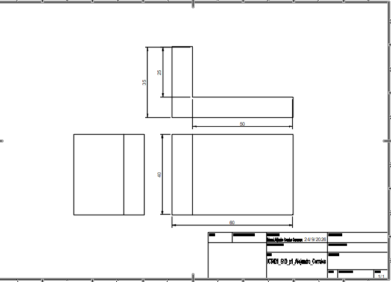
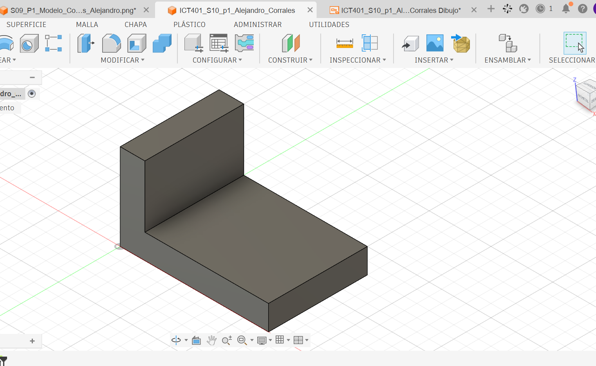
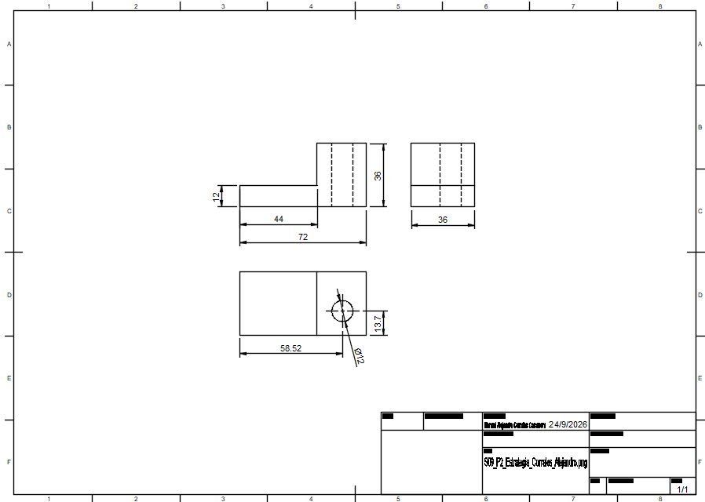

# ICT401 · Semana 10 — Registro de vistas técnicas y acotación normalizada

21 al 26 de septiembre de 2026.

- Estudiante: [Respuesta]
- Grupo: [Respuesta]
- Carpeta o proyecto de Fusion Cloud con acceso docente: [Respuesta]
- Modelos utilizados: `ICT401_S09_P1_Corrales_Alejandro`, `ICT401_S09_P2_Corrales_Alejandro`, `ICT401_S09_P3_Corrales_Alejandro` u otros equivalentes.

## Instrucciones

Copie esta plantilla a `Portafolio/semana10/` y guárdela como `S10_Registro_Apellido_Nombre.md`. Sustituya `Apellido_Nombre` por un apellido y un nombre sin espacios ni tildes. Complete cada `[Respuesta]`, agregue las imágenes solicitadas en la misma carpeta y haga commit.

Documente cada decisión de selección de vistas y acotación. Si modifique una decisión durante el proceso, no borre lo anterior: describa qué cambio, qué evidencia del modelo o del Drawing motivó la corrección y qué ajuste realizó.

X = ancho, Y = profundidad, Z = altura. Trabaje en milímetros. Cuando compare vistas, mantenga Front, Top y Right con orientación coherente y cámara ortográfica.

---

## P1 — Del modelo 3D a las vistas técnicas

### P1.1 · Modelo utilizado

- Nombre del diseño en Fusion: [ICT401_S09_P1_Corrales_Alejandro]
- Pieza de referencia (semana de origen): [Semana 9]

### P1.2 · Características principales del modelo

| Característica | Descripción | Vista(s) que la comunican |
|---|---|---|
| 1 | La pieza presenta una base rectangular. | Front, Top y Right |
| 2 | en la parte vertical parte vertical que sale de la base. | Front y Right |
| 3 | Al verla de frente se puede observar su forma de L. | Front |
| 4 | Desde arriba se puede ver la profundidad y dónde está ubicada la parte vertical. | Top y Right |

### P1.3 · Vistas seleccionadas y justificación

| Vista | ¿Es necesaria? | ¿Por qué? | ¿Qué información aporta? |
|---|---|---|---|
| Front | Sí | es porque permite ver la forma principal de la pieza. | Muestra el ancho, la altura y la forma en L. |
| Top | Sí | Porque permite ver cómo están ordenadas las partes desde arriba. | Muestra la profundidad y la posición de la pared. |
| Right | Sí | Porque ayuda a comprobar las medidas de la pieza de lado. | Muestra la profundidad y las diferentes alturas. |
| Otra: Isométrica | No | Porque las vistas principales ya muestran lo necesario. | Sirve como apoyo para entender mejor la forma completa de la pieza. |

### P1.4 · ¿Alguna vista resultó redundante? ¿Cuál y por qué?

Consideré que la vista isométrica no era indispensable, ya que las vistas Front, Top y Right muestran la información necesaria de la pieza. Aun así, ayuda a tener una mejor idea de cómo se ve el modelo completo.

### P1.5 · Método utilizado para generar las vistas en Fusion

Primero abrí la pieza que había realizado en la Semana 9. Luego coloqué el modelo en las vistas Front, Top y Right usando el ViewCube de Fusion. Al final revisé cada vista para asegurarme de que coincidiera con la forma del modelo.
### Evidencias P1

Captura de las vistas ortogonales generadas desde el modelo.

Modelo 3D en orientación isométrica con nombre y ViewCube visibles.

---

## P2 — Creación del plano desde el modelo

### P2.1 · Configuración del Drawing

- Formato seleccionado: A4.
- Orientación: Horizontal.
- Escala: 1:1.
- Justificación de cada elección: Usé el formato A4 en horizontal porque había suficiente espacio para acomodar las tres vistas sin que quedaran muy juntas. Dejé la escala en 1:1 porque el tamaño de la pieza permite verla bien y colocar las medidas de forma clara.

### P2.2 · Disposición de vistas

| Vista | Posición en el Drawing | Distancia a la vista adyacente | ¿Alineada correctamente? |
|---|---|---|---|
| Front (base) | Parte superior izquierda | Dejé suficiente espacio entre las vistas. | Sí |
| Top | Debajo de la vista Front | Dejé espacio para colocar las cotas. | Sí |
| Right | A la derecha de la vista Front | Dejé una separación para que las vistas no quedaran juntas. | Sí |

### P2.3 · ¿Qué problemas de alineación o disposición detectó? ¿Cómo los resolvió?

Tuve que cambiar un poco la posición de las vistas para que quedaran mejor acomodadas. Las separé y revisé que mantuvieran la posición correcta entre Front, Top y Right.

### P2.4 · ¿La escala permite legibilidad de todas las vistas? Justifique.

Sí, con la escala 1:1 se puede observar la pieza con claridad y distinguir bien sus medidas. También permite que las vistas tengan suficiente espacio entre ellas dentro de la hoja.

### Evidencias P2

Captura del Drawing con las tres vistas insertadas y alineadas.

---

## P3 — Acotación normalizada básica

### P3.1 · Dimensiones generales aplicadas

| Dimensión | Valor | Vista donde se colocó | Justificación |
|---|---:|---|---|
| Ancho total (X) | 72 mm | Front | La coloqué aquí porque se puede apreciar todo el ancho de la pieza. |
| Profundidad total (Y) | 36 mm | Top | La puse en esta vista porque muestra mejor la profundidad completa. |
| Altura total (Z) | 36 mm | Front | La coloqué en Front porque ahí se distingue mejor la altura de la pieza. |

### P3.2 · Dimensiones parciales y funcionales

| Característica | Dimensión | Valor | Vista | ¿Repetida en otra vista? |
|---|---|---:|---|---|
| Parte elevada | Ancho | 28 mm | Front | No |
| Base | Altura | 12 mm | Front | No |
| Agujero | Diámetro | Ø12 mm | Top | No |
| Agujero | Ubicación del centro | (14, 18) mm | Top | No |

### P3.3 · ¿Eliminó alguna cota por redundante? ¿Cuál?

Sí, algunas medidas se podían mostrar en más de una vista, pero decidí colocarlas una sola vez para que el plano no tuviera información repetida.

### P3.4 · ¿Alguna dimensión quedó dentro del contorno de la vista? ¿Qué hizo al respecto?

Al colocar las medidas, algunas quedaban muy pegadas al dibujo. Las moví un poco hacia afuera para que quedaran más ordenadas y fueran fáciles de leer.

### P3.5 · ¿Qué criterio de organización utilizó para disponer las cotas?

Fui acomodando las cotas según la parte de la pieza que correspondía. Dejé las medidas generales más alejadas y las demás más cerca de cada detalle, tratando de que no se cruzaran ni quedaran amontonadas.
### Evidencias P3

Captura del Drawing con las cotas aplicadas.

Detalle de una zona del plano donde se aprecie la organización de las cotas.

---

## P4 — Práctica guiada de plano técnico

### P4.1 · Pieza documentada

- Nombre del diseño: [Respuesta]
- Pieza de referencia: [Respuesta]

### P4.2 · Vistas generadas

| Vista | Información que comunica | Cotas asignadas |
|---|---|---|
| Front | [Respuesta] | [Respuesta] |
| Top | [Respuesta] | [Respuesta] |
| Right | [Respuesta] | [Respuesta] |

### P4.3 · Resumen de cotas aplicadas

| Tipo de dimensión | Cantidad | Ejemplo |
|---|---|---|
| Generales | [Respuesta] | [Respuesta] |
| Parciales | [Respuesta] | [Respuesta] |
| Funcionales | [Respuesta] | [Respuesta] |

### P4.4 · ¿El plano contiene información suficiente para fabricar la pieza? ¿Falta algo?

[Respuesta]

### P4.5 · Errores encontrados y correcciones realizadas

| Error detectado | Corrección aplicada | Vista afectada |
|---|---|---|
| [Respuesta] | [Respuesta] | [Respuesta] |
| [Respuesta] | [Respuesta] | [Respuesta] |

### Evidencias P4

Drawing completo con vistas y cotas.

Comparación del Drawing con el modelo 3D.

---

## Reflexión final

La diferencia principal entre documentar una pieza en Semana 9 (reconstrucción desde plano) y documentarla en Semana 10 (generación de vistas desde modelo) es:

[Respuesta]

Los criterios que utilicé para seleccionar las vistas necesarias fueron:

[Respuesta]

Los principios de acotación normalizada que más influyeron en la claridad de mi plano fueron:

[Respuesta]

Si tuviera que agregar una vista adicional a una de mis piezas, sería:

[Respuesta]

## Checklist

- [ ] Seleccioné las vistas necesarias y justifiqué cada una.
- [ ] Generé las vistas ortogonales correctamente alineadas.
- [ ] Configuré formato, orientación y escala de manera coherente.
- [ ] Apliqué dimensiones generales, parciales y funcionales.
- [ ] Evité cotas repetidas, ambiguas o innecesarias.
- [ ] Organice las cotas fuera del contorno de las vistas.
- [ ] El plano contiene información suficiente para fabricar la pieza.
- [ ] Documenté errores y correcciones sin borrar decisiones iniciales.
- [ ] Las evidencias se visualizan correctamente en GitHub.
- [ ] Los Drawing están disponibles en Fusion Cloud con acceso docente.
- [ ] Completé la reflexión final.

## Cierre del Portafolio Técnico 2

La revisión del portafolio abarca las **semanas 6 a 10**. El plazo para completar y publicar los pendientes de **Semana 10** es el **viernes 25 de septiembre de 2026, a las 11:59 p. m., hora de Costa Rica**. Este plazo no habilita correcciones de las semanas 6 a 9.

Antes del cierre verifique:

- [ ] Las fichas de las semanas 6--10 están completas en `Portafolio/semanaXX/`.
- [ ] Las imágenes y enlaces se visualizan correctamente desde GitHub.
- [ ] Las correcciones están documentadas sin borrar respuestas iniciales.
- [ ] Los modelos están disponibles en Fusion Cloud con acceso docente.
- [ ] Los últimos cambios están publicados en GitHub.

Commit sugerido: `S10 ejercicios Fusion Apellido Nombre`.

Corrección posterior: `S10 correccion Fusion Apellido Nombre`.
