# ICT401 · Semana 12 — Registro de formato, cajetín y salidas técnicas

5 al 10 de octubre de 2026.

- Estudiante: [Alejandro Corrales Casanova]
- Grupo: [60]
- Proyecto de Fusion Cloud con acceso docente: [S09_P1_drawing_Corrales_Alejandro]
- Drawing de referencia de Semana 11: [S09_P1_drawing_Corrales_Alejandro]
- Modelo utilizado: [S09_P3_Modelo_Corrales_Alejandro]
- Laboratorio integrador II-A: [Respuesta]
- Fase 2 del Proyecto: [Respuesta]

## Instrucciones

Utilice esta plantilla en la carpeta o plataforma oficial de entrega indicada por la persona docente y guárdela como `S12_Registro_Apellido_Nombre.md`. Sustituya `Apellido_Nombre` por un apellido y un nombre sin espacios ni tildes. Complete cada `[Respuesta]` y agregue las imágenes solicitadas junto con la ficha.

Conserve las decisiones iniciales y documente las correcciones. No borre una decisión anterior: explique qué cambió, qué problema motivó el cambio y cómo comprobó el resultado.

Trabaje sobre el modelo y el Drawing de Semana 11. Use milímetros, orientación coherente y el mismo proyecto de Fusion Cloud. Esta ficha registra el proceso; complétela durante cada lección, no al final de memoria.

**Ayuda de Fusion:** para comandos de Drawing consulte Autodesk Fusion Help, sección `Drawings`: <https://help.autodesk.com/view/fusion360/ENU/>. En esta ficha se utilizan `Design > File > New Drawing > From Design`, `Output > PDF`, `Output > DXF`, `Output > Print`, `Edit Sheet` y `Edit Title Block`. Si su versión utiliza otra etiqueta, escriba el nombre real del comando y adjunte la captura del cuadro o panel utilizado.

**Límite:** no modifique la geometría para resolver problemas de formato. No adelante ensamblajes, vistas explosionadas, fabricación digital ni control dimensional metrológico.

## Cómo funciona el Laboratorio integrador II-A

El laboratorio es un proceso acumulativo de cinco etapas. **P1, P2, P3 y P4 son prácticas formativas**: en cada una toma una decisión, realiza una corrección y conserva evidencias para continuar. **P5 no es un plano nuevo ni una actividad independiente**; utiliza el Drawing corregido durante P1–P4 para realizar la revisión final, comprobar las salidas y organizar la entrega.

| Etapa | Función | Resultado que pasa a la siguiente etapa |
|---|---|---|
| P1 | Diagnosticar el plano y seleccionar formato, orientación y escala. | Decisión justificada y estado inicial documentado. |
| P2 | Aplicar la hoja, distribuir vistas y completar el cajetín. | Drawing organizado y correcciones registradas. |
| P3 | Controlar escala, legibilidad, cotas, tolerancias y anotaciones. | Drawing validado o correcciones pendientes identificadas. |
| P4 | Exportar PDF/DXF y comparar las salidas con el Drawing. | Archivos revisados y discrepancias corregidas o registradas. |
| P5 | Integrar, revisar, imprimir y entregar el plano final. | Producto evaluable y evidencias finales. |

P5 corresponde al **Laboratorio integrador II-A, con valor de 10 %**. La **Fase 2 del Proyecto, con valor de 7 %**, utiliza este mismo proceso y registro, pero se entrega además conforme a su enunciado y rúbrica oficiales. Conserve las decisiones y capturas de P1–P4: forman parte de la trazabilidad del laboratorio y no se sustituyen por una sola captura del resultado final.

## Criterios normativos transversales

Use las referencias normativas disponibles en el aula virtual como criterios de control. No declare conformidad normativa solo porque el archivo tenga la extensión correcta o porque una configuración sea la predeterminada de Fusion.

| Referencia | Qué se revisa en esta semana | Evidencia o registro requerido |
|---|---|---|
| ISO 5457 | Formato, orientación, marco y zona útil de la hoja. | Decisión de formato justificada y captura de la hoja completa. |
| INTE/ISO 7200:2008, 5--6 | Espacios de información y composición del cajetín. | Campos identificables, número de identificación, fecha, título, autor, estado o revisión y datos de hoja cuando correspondan. |
| ISO 128-1:2020 e ISO 128-3 | Coherencia de representación, vistas, cortes y secciones. | Alineación, identificación de corte o detalle y comparación con el modelo. |
| ISO 129-1:2018, 4--6 | Necesidad, unicidad, ubicación y legibilidad de cotas; revisión de tolerancias existentes. | Tabla de control de anotaciones y capturas ampliadas. |
| ISO 16792:2021, 4--5.3 | Integridad y relación entre modelo, Drawing, archivos exportados, identificación y revisión. | Enlace de Fusion, nombres de archivos, versión o revisión y comparación de salidas. |

### Registro de aplicación normativa

| Referencia | Apartado o criterio aplicado | Evidencia asociada | Resultado o limitación |
|---|---|---|---|
| ISO 5457 | Se utilizó formato A3 en orientación horizontal, manteniendo marco, cajetín y espacio suficiente para organizar las vistas. | S12_P1_DecisionFormato_Corrales_Alejandro.png | Conforme para el ejercicio. |
| INTE/ISO 7200:2008 | Se revisó la información del cajetín, incluyendo título, autor, fecha, identificación del plano, revisión y número de hoja. | S12_P2_Cajetin_Corrales_Alejandro.png | Se completaron los campos disponibles en Fusion. |
| ISO 128-1:2020 e ISO 128-3 | Se revisó la organización de las vistas, la identificación de las secciones A-A y B-B y el detalle C. | S12_P3_HojaCompleta_Corrales_Alejandro.png | Las vistas y secciones se mantienen identificadas y relacionadas. |
| ISO 129-1:2018 | Se revisó la legibilidad y ubicación de las cotas y anotaciones del Drawing. | S12_P3_Legibilidad_Corrales_Alejandro.png | No fue necesario agregar nuevas cotas ni tolerancias. |
| ISO 16792:2021 | Se comprobó que el Drawing y las salidas PDF y DXF correspondieran al mismo plano. | S12_P4_Comparacion_Corrales_Alejandro.png | El Drawing, PDF y DXF muestran el mismo contenido técnico. |
Si la plantilla o la versión de Fusion no permite mostrar un dato, escriba la limitación concreta. Las medidas propias de la actividad deben identificarse como decisiones didácticas, no como dimensiones ISO.

## P1 — Diagnóstico del plano y selección del formato

**Propósito:** analizar el Drawing de Semana 11 y seleccionar formato, orientación y escala inicial.

**Entorno:** Fusion, espacios `Design` y `Drawing`. En P1 no se modifica la geometría.

### P1.0 · Pasos en Fusion

1. Abra Fusion y seleccione el proyecto que contiene el modelo de Semana 11.
2. En `Design`, confirme que el cuerpo y las características coinciden con el Drawing anterior. No edite la geometría.
3. Abra el Drawing y confirme que aparecen vistas, corte o sección, detalle, cotas y tolerancias cuando correspondan.
4. En el navegador, seleccione la hoja y abra la opción de edición de hoja, normalmente `Edit Sheet`.
5. Registre formato, orientación y unidades actuales sin aplicar todavía cambios.
6. Observe la hoja completa y anote al menos tres problemas de espacio o legibilidad.
7. Compare las alternativas de formato de la plantilla.
8. Elija formato, orientación y escala inicial según la información que debe conservarse.
9. Guarde la justificación en esta ficha y conserve una captura del estado inicial.

### P1.1 · Estado de referencia

- Nombre del proyecto Fusion: ICT401
- Nombre del diseño: S09_P3_Modelo_Corrales_Alejandro
- Nombre del Drawing: S12_P3_Drawing_Corrales_Alejandro
- Formato actual: A3
- Orientación actual: Horizontal
- Unidades: mm
- Escala actual de la hoja o vistas: Vistas principales 1:1 y detalle C en 2:1

### P1.2 · Diagnóstico

| Problema observado | Ubicación exacta en la hoja | Por qué afecta la entrega | Corrección prevista |
|---|---|---|---|
| Algunas vistas están muy juntas. | En la parte central de la hoja. | Puede dificultar la lectura y hacer que el plano se vea cargado. | Separar mejor las vistas y aprovechar el espacio disponible. |
| El detalle C queda algo alejado de su zona de origen. | Lado izquierdo del plano. | Puede hacer menos clara la relación entre el detalle y la vista principal. | Acercar el detalle a la vista de donde sale. |
| El cajetín tiene poco espacio para algunos datos. | Parte inferior derecha. | Puede hacer que la información quede muy pequeña o difícil de leer. | Revisar el tamaño y acomodar mejor los campos del cajetín. |
### P1.3 · Comparación de alternativas

| Alternativa | Ventaja | Limitación | ¿La selecciono? |
|---|---|---|---|
| A3 horizontal | Da suficiente espacio para las vistas, la sección, el detalle y el cajetín. | Ocupa una hoja más grande. | Sí |
| A4 horizontal | Usa una hoja más pequeña. | Las vistas y las cotas quedarían más juntas y podrían perder claridad. | No |

- Formato seleccionado: A3
- Orientación seleccionada: Horizontal
- Escala inicial seleccionada: 1:1 en las vistas principales y 2:1 en el detalle.
- Justificación técnica: Elegí A3 horizontal porque permite acomodar todo el plano con espacio suficiente y mantener las vistas y anotaciones fáciles de leer.
- Criterio de ISO 5457 aplicado: Se escogió una hoja que permita mantener el marco, el cajetín y una zona útil suficiente para organizar el plano.
- ¿Qué parte de la selección es una decisión didáctica de la plantilla?: El uso de A3 horizontal y la distribución final de las vistas se eligieron según el espacio disponible en este ejercicio.

### Evidencias P1

**Qué debe contener cada imagen:**

- `S12_P1_PlanoInicial_Apellido_Nombre.png`: captura del Drawing completo, con nombre de la hoja o del Drawing visible y suficiente contexto para localizar los problemas.
- `S12_P1_Diagnostico_Apellido_Nombre.png`: una sola lámina con al menos tres problemas marcados y etiquetados sobre el plano.
- `S12_P1_DecisionFormato_Apellido_Nombre.png`: configuración de hoja o alternativa seleccionada, con formato, orientación o escala identificables.

Una captura aislada del cuadro de diálogo no demuestra que el formato sea adecuado para el plano.

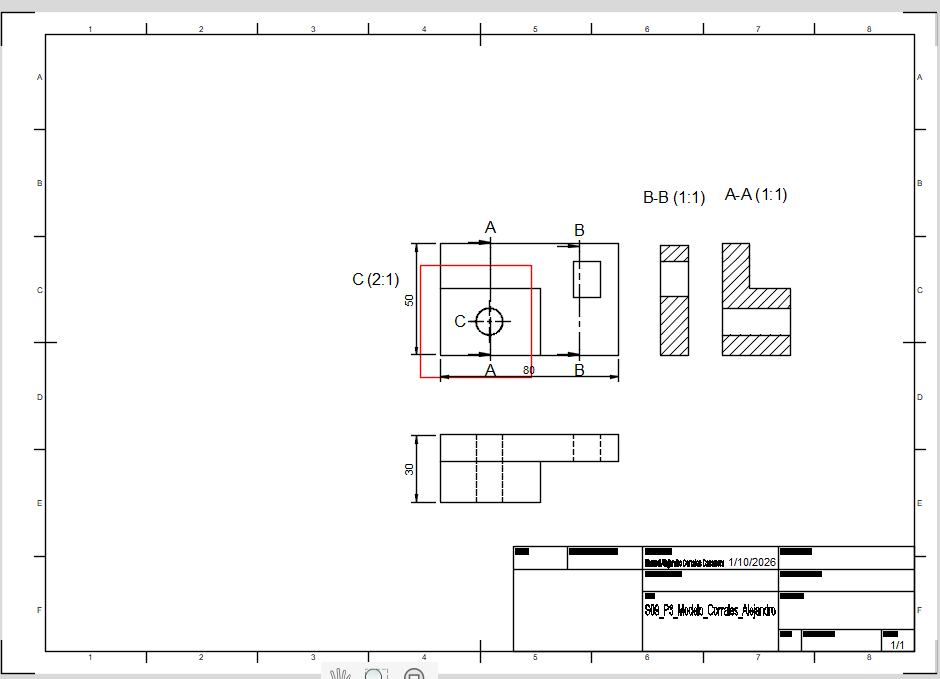

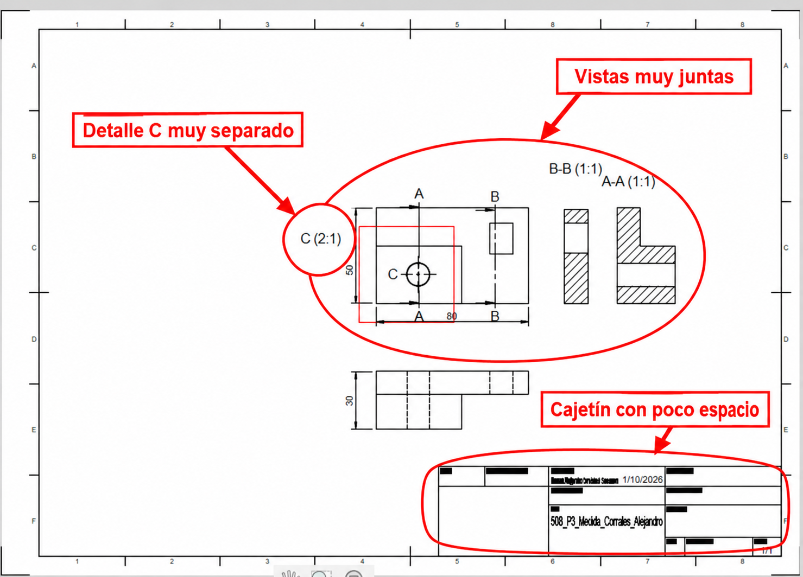

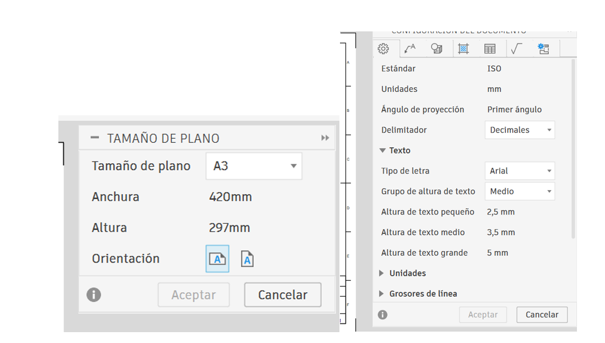

## P2 — Aplicación de hoja, distribución y cajetín

**Propósito:** aplicar el formato seleccionado, organizar la información y completar el cajetín.

**Entorno:** Fusion, espacio `Drawing`. No se modifica la geometría del modelo.

### P2.0 · Pasos en Fusion

1. Abra la versión de P1 y confirme que trabaja sobre el Drawing correcto.
2. Seleccione la hoja en el navegador y ejecute `Edit Sheet` o el comando equivalente.
3. Aplique formato, orientación y unidades seleccionados en P1. Acepte la edición.
4. Mantenga juntas las vistas que comparten dimensiones y reserve espacio para cotas y anotaciones.
5. Reubique vistas sin romper la alineación entre `Front`, `Top` y `Right`.
6. Reubique el corte o la sección sin perder su identificación ni su relación con las vistas.
7. Reubique el detalle ampliado sin separarlo de la vista de origen.
8. Haga clic derecho sobre el cajetín y seleccione `Edit Title Block` o el comando equivalente.
9. Complete código ICT401, título de la pieza, nombre del estudiante, fecha, unidades, escala y los demás campos requeridos por la plantilla.
10. Cierre la edición del cajetín y compruebe que ningún texto invada vistas, cotas, rayado o bordes.
11. Guarde el Drawing en Fusion Cloud.

### P2.1 · Configuración aplicada

- Formato final de la hoja: A3
- Orientación: Horizontal
- Unidades: mm
- Escala escrita en el cajetín: 1:1
- Escala configurada en las vistas: 1:1 en las vistas principales y 2:1 en el detalle C
- ¿Coinciden ambas escalas?: Sí, tomando en cuenta que el detalle tiene una escala diferente indicada aparte.
- Campos completados del cajetín: Título, autor, fecha, tipo de documento, estado, número de dibujo, revisión y número de hoja.
- Número de identificación del documento: S12_P3_Corrales_Alejandro
- Fecha de emisión o entrega: 08/10/2026
- Autor: Manuel Alejandro Corrales Casanova
- Estado o revisión: Final / Revisión A
- Campos normativos no disponibles en Fusion: No se completaron campos que no aparecían disponibles o que no fueron solicitados.

### P2.2 · Distribución

| Elemento | Posición final | ¿Está alineado o relacionado correctamente? | Corrección realizada |
|---|---|---|---|
| Front | Parte inferior central | Sí | Se dejó alineada con las otras vistas principales. |
| Top | Parte central de la hoja | Sí | Se acomodó dejando más espacio alrededor. |
| Right | Lado izquierdo | Sí | Se mantuvo relacionada con las vistas principales. |
| Corte o sección | Lado derecho | Sí | Se separó un poco para que se distinguiera mejor. |
| Detalle | Cerca de la vista de origen | Sí | Se acercó para que fuera más fácil relacionarlo con la pieza. |
| Cajetín | Parte inferior derecha | Sí | Se completaron y acomodaron los datos para que fueran legibles. |

### P2.2 · Distribución

| Elemento | Posición final | ¿Está alineado o relacionado correctamente? | Corrección realizada |
|---|---|---|---|
| Front | Parte inferior central | Sí | Se dejó alineada con las otras vistas principales. |
| Top | Parte central de la hoja | Sí | Se acomodó dejando más espacio alrededor. |
| Right | Lado izquierdo | Sí | Se mantuvo relacionada con las vistas principales. |
| Corte o sección | Lado derecho | Sí | Se separó un poco para que se distinguiera mejor. |
| Detalle | Cerca de la vista de origen | Sí | Se acercó para que fuera más fácil relacionarlo con la pieza. |
| Cajetín | Parte inferior derecha | Sí | Se completaron y acomodaron los datos para que fueran legibles. |
### Evidencias P2

**Qué debe contener cada imagen:**

- `S12_P2_HojaDistribucion_Apellido_Nombre.png`: Drawing completo con formato aplicado, vistas distribuidas, sección, detalle y cajetín en contexto.
- `S12_P2_Cajetin_Apellido_Nombre.png`: recorte legible del cajetín completo, incluyendo código ICT401, título, autoría, fecha, unidades y escala.
- `S12_P2_Correcciones_Apellido_Nombre.png`: comparación antes/después o lámina que muestre una corrección real de distribución.

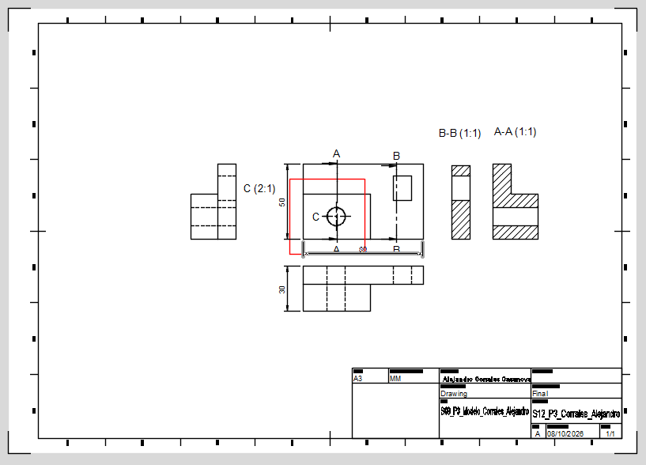

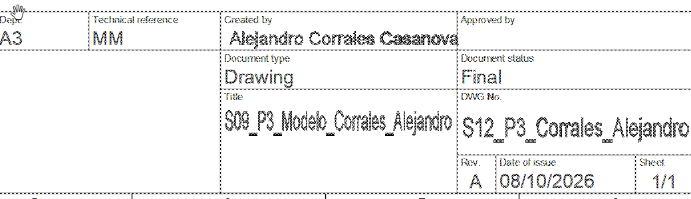

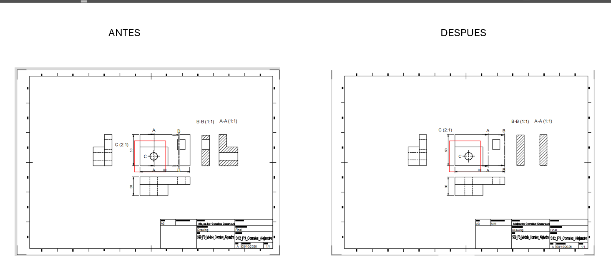

## P3 — Escala, legibilidad y control de anotaciones

**Propósito:** comprobar que la escala permite leer la hoja completa y las zonas con información técnica.

**Entorno:** Fusion, espacio `Drawing`.

### P3.0 · Pasos en Fusion

1. Abra el Drawing de P2 y registre la escala de la hoja y de cada vista.
2. Observe la hoja completa y localice textos, flechas, cotas, rayado o detalles ilegibles.
3. Acerque el zoom para comprobar textos y dimensiones; vuelva a la vista completa para comprobar composición.
4. Verifique que `Front`, `Top` y `Right` sigan alineadas.
5. Verifique que el corte conserve su identificación y que el detalle tenga letra y escala.
6. Si una vista requiere otra escala, selecciónela y modifique la propiedad de escala desde el panel de Fusion. No la redimensione arrastrando sin control.
7. Reubique la vista si invade otra vista, una cota, el cajetín o el borde de la hoja.
8. Revise que cada cota se asocie con una característica y no dependa de una línea oculta.
9. No agregue nuevas tolerancias en P3. Solo revise las que provienen de Semana 11.
10. Guarde cada corrección en la tabla de esta ficha.

### P3.1 · Control de escala

- Escala antes de la revisión: 1:1 en las vistas principales y 2:1 en el detalle C.
- Escala después de la revisión: 1:1 en las vistas principales y 2:1 en el detalle C.
- ¿Se cambió la escala?: No.
- Motivo de la decisión: La escala que ya tenía el plano permite leer bien las vistas, las cotas y el detalle sin que la hoja se vea demasiado cargada.
- ¿La escala del cajetín coincide?: Sí.
- ¿Las cotas necesarias aparecen una sola vez, salvo indicación auxiliar?: Sí.
- ¿Las cotas se ubican en la vista más clara y evitan líneas ocultas?: Sí.
### P3.2 · Control de legibilidad

| Elemento revisado | Problema encontrado | Corrección | Resultado verificado |
|---|---|---|---|
| Cotas | No se encontraron problemas importantes. | No fue necesario hacer cambios. | Las cotas se leen con claridad. |
| Texto y notas | No se encontraron problemas importantes. | No fue necesario hacer cambios. | El texto se puede leer bien. |
| Corte o sección | La sección se observa correctamente. | No fue necesario modificarla. | La identificación y el rayado se distinguen bien. |
| Detalle | El detalle se mantiene claro y relacionado con su vista de origen. | No fue necesario moverlo. | La letra y la escala se pueden identificar. |
| Tolerancia | No se agregó una tolerancia nueva. | Se mantuvo la medida nominal. | El plano conserva la información necesaria. |
### Evidencias P3

**Qué debe contener cada imagen:**

- `S12_P3_HojaCompleta_Apellido_Nombre.png`: hoja completa después de la corrección, sin ocultar el cajetín ni las vistas.
- `S12_P3_Legibilidad_Apellido_Nombre.png`: una lámina con al menos dos recortes ampliados donde se lean cotas y anotaciones.
- `S12_P3_ControlEscala_Apellido_Nombre.png`: escala visible en propiedades de la vista o configuración y escala correspondiente del cajetín.

Si no cambió la escala, la ficha debe explicar por qué la escala inicial conservaba la legibilidad.

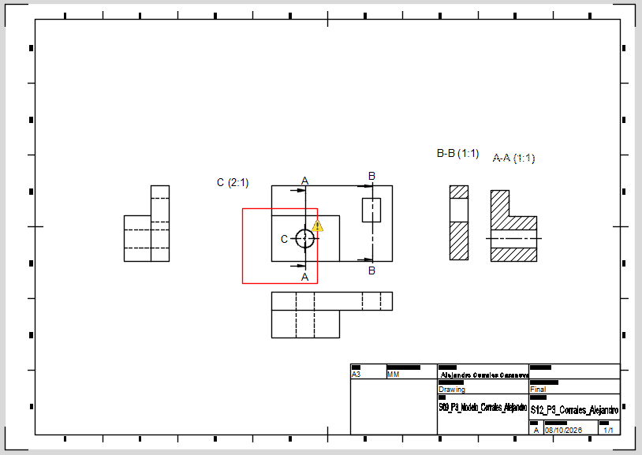

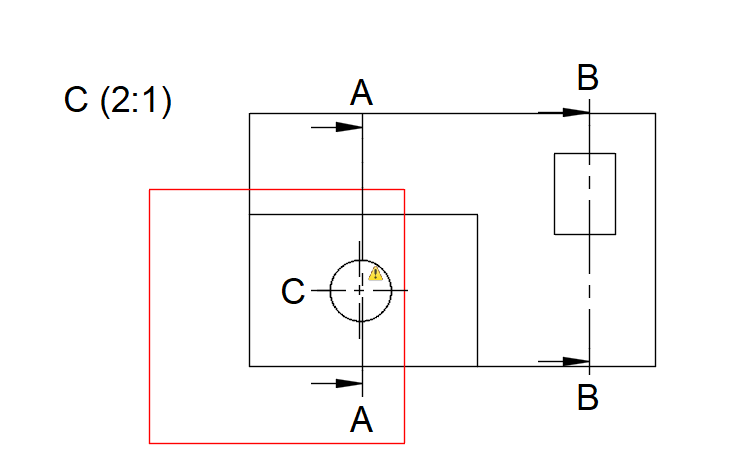

## P4 — Salidas PDF/DXF y previsualización técnica

**Propósito:** generar las salidas solicitadas y comprobar que corresponden al Drawing.

**Entorno:** Fusion, espacio `Drawing`, visor PDF y visor CAD disponible.

### P4.0 · Salida PDF

1. Guarde el Drawing y confirme la hoja activa.
2. Abra `Output` y seleccione `PDF` o el comando equivalente.
3. Seleccione únicamente la hoja final solicitada.
4. Utilice el nombre `S12_PlanoFinal_Apellido_Nombre.pdf`.
5. Guarde el archivo en la carpeta de Semana 12.
6. Abra el PDF fuera de Fusion.
7. Compruebe tamaño de papel, orientación, márgenes, cajetín, vistas, cotas, rayado y detalle.
8. Compare el PDF con el Drawing. Si aparece recortado, girado, vacío o deformado, repita la exportación después de corregir la configuración.

### P4.1 · Salida DXF

1. Genere el DXF solamente si la plantilla o la rúbrica lo solicita.
2. En `Output`, seleccione `DXF` o el comando equivalente.
3. Confirme hoja, unidades, nombre y opciones de exportación.
4. Utilice el nombre `S12_PlanoFinal_Apellido_Nombre.dxf`.
5. Guarde el archivo en la carpeta de Semana 12.
6. Abra o previsualice el DXF en el programa disponible.
7. Compruebe que corresponde al Drawing y registre qué elementos contiene.
8. No convierta el archivo con otra herramienta para ocultar una discrepancia. Registre la limitación y consulte si la salida disponible no coincide con la rúbrica.
## P4.2 · Registro de exportación

| Archivo | Comando utilizado | Unidades | Hoja/orientación | ¿Coincide con Drawing? | Corrección |
|---|---|---|---|---|---|
| PDF | Impresión / salida PDF | mm | A3 horizontal en el Drawing | Sí | No fue necesario realizar cambios después de la revisión. |
| DXF | Salida DXF | mm | Correspondiente al D

### Evidencias P4

**Qué debe contener cada imagen:**

- `S12_P4_Drawing_Apellido_Nombre.png`: hoja final en Fusion antes de exportar.
- `S12_P4_PDF_Apellido_Nombre.png`: PDF abierto, con hoja, cajetín y contenido técnico visibles.
- `S12_P4_DXF_Apellido_Nombre.png`: DXF abierto o ventana de exportación con nombre y unidades, cuando se solicite.
- `S12_P4_Comparacion_Apellido_Nombre.png`: una sola lámina con recortes etiquetados `Fusion Drawing`, `PDF` y `DXF`.

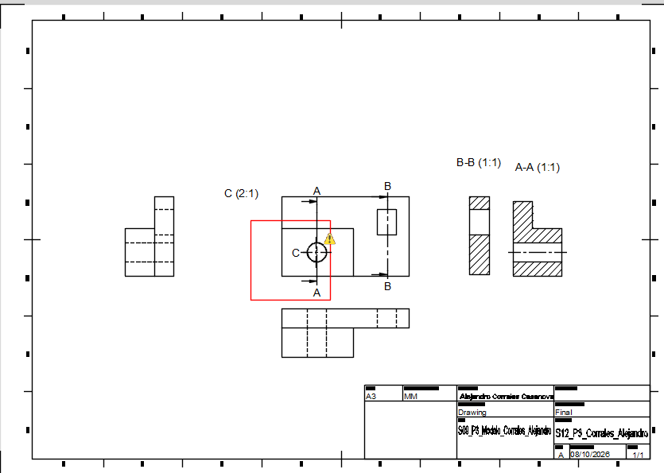

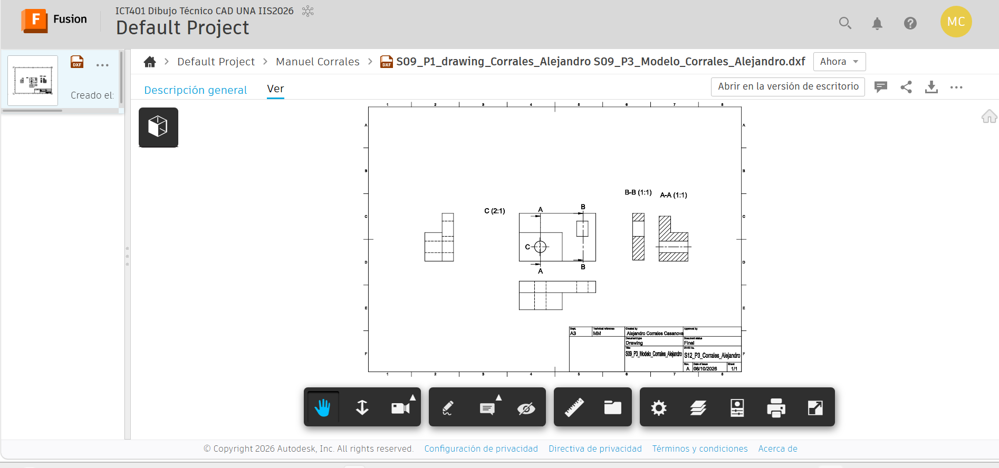

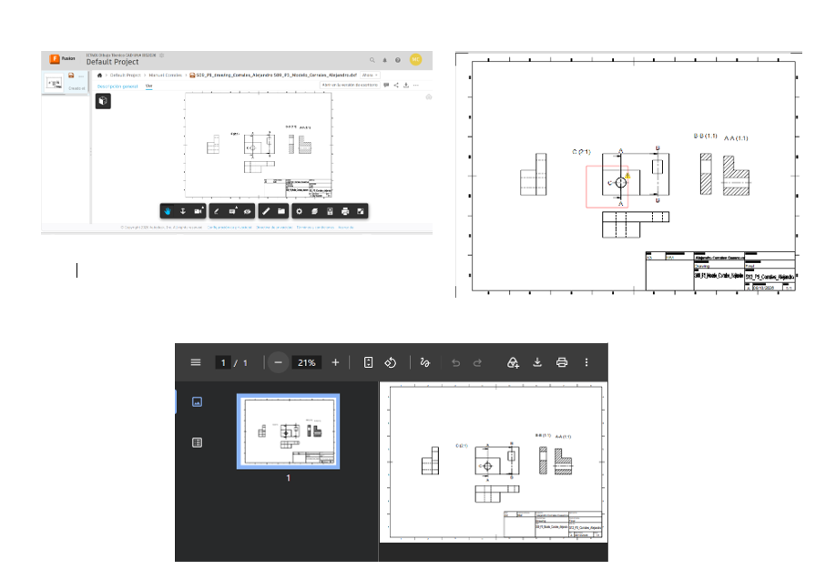

## P5 — Laboratorio integrador II-A, impresión y entrega

**Propósito:** integrar, revisar y entregar el plano técnico completo a partir del Drawing corregido en P1–P4. P5 es evaluativo; no cree un plano nuevo ni repita el proceso desde cero.

**Valor:** Laboratorio integrador II-A, 10 %. La Fase 2 del Proyecto tiene valor de 7 % y se entrega según su enunciado y rúbrica oficiales.

### P5.0 · Pasos en Fusion

1. Abra el Drawing que conserva las correcciones de P1 a P4.
2. Confirme que el modelo y el Drawing pertenecen al mismo proyecto y pieza.
3. Revise en la hoja completa formato, orientación, márgenes y distribución.
4. Revise el cajetín: código ICT401, título, autoría, fecha, unidades, escala y campos de la plantilla.
5. Revise alineación de `Front`, `Top` y `Right`, sección, detalle, cotas y tolerancias.
6. Cambie a `Design` y compare una característica visible del plano con el modelo 3D.
7. Registre cualquier discrepancia; no maquille el Drawing para que coincida visualmente.
8. Regrese a `Drawing` y aplique la corrección indicada por la revisión.
9. Ejecute `Output > PDF`, abra el PDF y compruebe que no hay recortes ni deformaciones.
10. Ejecute `Output > DXF` únicamente si corresponde y revise su contenido.
11. Abra `Output > Print` o la previsualización de impresión.
12. Compruebe papel, orientación, escala, márgenes y ausencia de recorte. Si se exige escala técnica, no seleccione `Fit to page`.
13. Guarde el Drawing en Fusion Cloud y confirme acceso docente.
14. Organice ficha, imágenes, PDF, DXF y enlaces en la carpeta oficial.
15. Complete el checklist final y registre los pendientes reales.

## P5.1 · Checklist

- [x] El modelo y el Drawing corresponden a la misma pieza.
- [x] El formato y la orientación son adecuados.
- [x] El cajetín está legible.
- [x] El formato, marco y zona de identificación fueron revisados con el criterio de ISO 5457.
- [x] Los campos disponibles del cajetín fueron contrastados con INTE/ISO 7200:2008.
- [x] La escala general y las escalas particulares están identificadas.
- [x] Las vistas están relacionadas y no falta información necesaria.
- [x] El corte, las secciones y el detalle conservan su identificación.
- [x] Las cotas son legibles y no presentan superposición importante.
- [x] Las cotas fueron revisadas con el criterio de ISO 129-1.
- [x] El PDF abre correctamente y coincide con el Drawing.
- [x] El DXF fue generado y revisado.
- [x] La previsualización de impresión fue revisada.
- [x] La ficha y las imágenes utilizan la nomenclatura solicitada.
- [ ] El enlace de Fusion Cloud tiene acceso docente.
- [x] El modelo, Drawing y archivos exportados no presentan contradicciones visibles.
- [ ] La Fase 2 del Proyecto fue entregada según su enunciado.

## P5.2 · Revisión por pares

| Criterio | Observación recibida | Corrección aplicada |
|---|---|---|
| Formato y orientación | No se realizó revisión por pares. | No aplica. |
| Cajetín | No se realizó revisión por pares. | No aplica. |
| Escala y legibilidad | No se realizó revisión por pares. | No aplica. |
| Distribución de vistas | No se realizó revisión por pares. | No aplica. |
| PDF/DXF e impresión | No se realizó revisión por pares. | No aplica. |
### Evidencias P5

**Qué debe contener cada imagen:**

- `S12_P5_PlanoFinal_Apellido_Nombre.png`: hoja completa en Fusion, con cajetín legible y todos los elementos del plano.
- `S12_P5_VerificacionModelo_Apellido_Nombre.png`: comparación etiquetada entre `Drawing` y `Design`, con una orientación que permita comprobar una característica representada.
- `S12_P5_PrevisualizacionImpresion_Apellido_Nombre.png`: previsualización con papel, orientación, escala y márgenes visibles.
- `S12_P5_Entrega_Apellido_Nombre.png`: carpeta o plataforma oficial de entrega mostrando ficha, PDF, DXF cuando corresponda y archivos organizados.

# Reflexión final

### 1. ¿Por qué el formato seleccionado es adecuado para este plano?

El formato A3 horizontal es adecuado porque permite colocar las vistas, secciones, el detalle y el cajetín sin que todo quede demasiado junto. También deja suficiente espacio para leer las cotas y anotaciones.

### 2. ¿Qué información del cajetín identifica o contextualiza el plano?

El cajetín permite identificar datos como el título del plano, el autor, la fecha, el número del dibujo, la revisión y el número de hoja. Estos datos ayudan a saber a qué trabajo pertenece el plano y cuál es su versión.

### 3. ¿Qué problema de escala o legibilidad detecté y cómo lo resolví?

Después de revisar el plano no fue necesario cambiar la escala. Las vistas principales se mantuvieron en 1:1 y el detalle C en 2:1 porque ambas escalas permiten observar la información de forma clara.

### 4. ¿Qué diferencia encontré entre el Drawing y la salida exportada?

No encontré una diferencia importante entre el Drawing y los archivos exportados. Al comparar el PDF y el DXF se observó que mantienen las vistas y la información principal del plano.

### 5. ¿Cómo comprobé que la impresión no deformara ni recortara el plano?

Se utilizó la previsualización de impresión para revisar los bordes, el cajetín y las vistas. El equipo solamente mostraba papel A4, por lo que se utilizó esta vista para comprobar que el contenido pudiera visualizarse completo y se registró esta limitación.

### 6. ¿Qué corrección mejoró más la calidad del plano?

La revisión de la distribución y del cajetín ayudó a que el plano quedara más ordenado y que la información principal pudiera identificarse con mayor facilidad.

---

# Cierre de la ficha

- [x] Completé las respuestas de P1 a P5.
- [x] Incorporé las evidencias realizadas con la nomenclatura solicitada.
- [x] El PDF fue abierto y comparado con el Drawing.
- [x] El DXF fue revisado.
- [x] Se comparó el modelo con el Drawing.
- [x] Se documentaron las decisiones y revisiones realizadas.
- [ ] Confirmar acceso docente al archivo de Fusion Cloud.
- [ ] Confirmar entrega de la Fase 2 según la rúbrica.
- [ ] Realizar la entrega final en el medio oficial indicado.

**Nombre de la entrega:**

`S12_PlanoFinal_Corrales_Alejandro`
Si realiza una corrección posterior, conserve la versión anterior y utilice una identificación que permita distinguir la nueva entrega.
